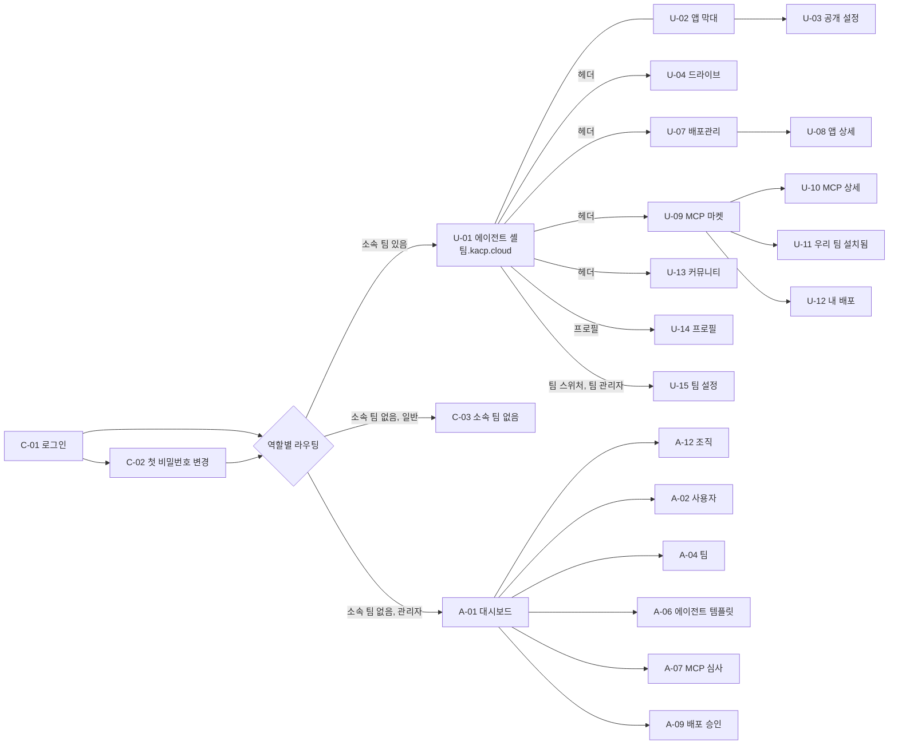

# 01. 화면 설계 — 목록과 설명

화면 시안은 Claude Design으로 만든다. 이 문서는 **무엇이 있어야 하고 무엇을 하는지**를 정한다.
Claude Design에 넘길 때는 화면 하나씩 이 문서의 해당 절 + `02-design-system.md`를 같이 준다.

- 화면 ID: `C-` 공통, `U-` 사원(팀원·팀 관리자), `A-` 플랫폼 관리자
- "데이터" 칸의 API는 `04-api.md` 기준(접두어 `/api/v1` 생략)
- 상태 문구와 배지 색은 `02-design-system.md`의 상태 표를 그대로 쓴다

## 1. 화면 지도

## 2. 호스트별 화면 배치

| 호스트 | 화면 |
|---|---|
| `app.kacp.cloud` | C-01~C-04, U-04~U-15, A-01~A-11 |
| `팀.kacp.cloud` | U-01 에이전트 셸(+U-02, U-03). `/claw/*`는 OpenClaw Control UI(iframe 안) |
| `앱--팀.kacp.cloud`, `앱.kacp.cloud` | 앱 자체. 앱이 없거나 멈췄으면 C-04 |

웹은 한 앱(`apps/web`)이 두 호스트를 모두 서빙하고, 호스트를 보고 라우터를 고른다.
헤더의 "에이전트"는 `https://{team}.kacp.cloud/`로, 나머지 메뉴는 `https://app.kacp.cloud/...`로 이동한다(쿠키가 `.kacp.cloud`라 로그인 유지).

## 2-1. 앱의 두 사본: 작업본과 공개본

에이전트가 만든 앱은 최대 두 개의 사본을 가진다. 화면은 항상 이 둘을 **따로** 보여준다.

| | 작업본 (Private) | 공개본 (Public) |
|---|---|---|
| 주소 | `앱--팀.kacp.cloud` | `앱.kacp.cloud` |
| 볼 수 있는 사람 | 팀원 | 로그인한 전 사원 |
| 내용 | 원본 폴더 그대로. 에이전트가 고치면 바로 반영 | 승인 시점 스냅샷. **다시 승인받아야 갱신** |
| 언제 생기나 | `run_app` 하면 항상 | 첫 공개 요청이 승인되면 |
| 데이터(DB) | 작업본 전용 | 공개본 전용 (서로 섞이지 않음) |
| 버전 | 없음 | v1, v2 … 승인될 때마다 +1 |

- Public이 되어도 **작업본은 사라지지 않는다.** 팀은 작업본에서 계속 고치고, 준비되면 "업데이트 요청"으로 공개본을 갱신한다.
- 두 사본 모두 **유휴 정지** 대상이다. 일정 시간 접속이 없으면 잠들고, 누가 주소로 들어오면 자동으로 깨어난다. 그래서 평소에는 공개본 하나만 떠 있는 경우가 대부분이다.
- "공개 중지"를 하면 공개본만 없어지고 작업본은 남는다.

## 2-2. 부서(조직)와 팀은 다르다

| | 부서 (조직) | 팀 |
|---|---|---|
| 뜻 | 실제 사내 소속 (본부 > 부서 > 파트) | 에이전트를 같이 쓰는 작업 단위 |
| 한 사람이 | **부서 하나**에 속함 | **여러 팀**에 들어갈 수 있음 |
| 구조 | 트리(상위·하위 부서) | 평평한 목록 |
| 누가 관리 | 플랫폼 관리자 (A-12), 나중에 SSO 조직도 연동 | 플랫폼 관리자 (A-04·A-05), 팀 관리자 (U-15) |
| 쓰는 곳 | 사용자 정보·검색·필터, 팀원 일괄 추가, v2 지식 권한 | 컨테이너·드라이브·앱·MCP |

- 부서는 팀을 만들지 않는다. "영업1팀"이라는 부서가 있어도 에이전트 팀은 따로 만든다.
- 사원 화면에서 부서는 **이름 옆 작은 회색 글씨**로만 보인다(예: "홍길동 · 영업1팀"). 사람을 찾을 때 동명이인을 구분하는 용도.

---

## 3. 공통 (C)

### C-00 공통 레이아웃 · 헤더

모든 로그인 후 화면(에이전트 셸 포함)의 상단 헤더. 높이는 낮게(48px 내외) 유지한다 — 에이전트 셸에서 iframe 공간을 최대한 남기기 위해서다.

| 영역 | 요소 | 설명 |
|---|---|---|
| 왼쪽 | 로고 | 클릭 시 현재 팀 에이전트로 |
| 왼쪽 · 팀 범위 | **팀 스위처** | 현재 팀 이름 + 드롭다운. 소속 팀 목록, 각 팀의 컨테이너 상태 점(사원 문구: 준비 중/사용 가능/쉬는 중/정리 중/문제 발생). 팀 관리자면 "팀 설정" 항목 |
| 왼쪽 · 팀 범위 | 에이전트 · 드라이브 · 배포관리 | 현재 팀 기준 메뉴. 현재 위치 강조 |
| 오른쪽 · 전사 범위 | 커뮤니티 · MCP 마켓 | 팀과 무관한 전사 메뉴. 팀 범위와 시각적으로 구분(구분선) |
| 오른쪽 | 알림 종 | 안 읽은 개수 배지. 클릭 시 C-06 |
| 오른쪽 | 프로필 | 이름 이니셜 아바타. 메뉴: 내 정보(U-14), 관리자 화면(플랫폼 관리자만), 로그아웃 |

- 관리자 화면(`/admin`)에서는 헤더 왼쪽이 "관리자" 표시 + 관리자 메뉴 사이드바로 바뀐다. 프로필 메뉴에 "사원 화면으로" 항목.
- 현재 팀은 URL(`/t/{team}/...` 또는 팀 호스트)이 결정한다. 마지막으로 쓴 팀은 로컬 저장소에 기억해 로그인 직후 이동에 쓴다.
- 데이터: `GET /auth/me`, `GET /me/teams`, `GET /me/notifications/unread-count`, `POST /auth/logout`

### C-01 로그인 — `app.kacp.cloud/login`

- 누가: 로그인 안 한 모든 사용자
- 구성: 로고와 서비스명, 이메일, 비밀번호, 로그인 버튼, 오류 문구 영역. 회원가입·비밀번호 찾기 링크는 **없다**(계정은 관리자가 만든다). "계정이 없거나 비밀번호를 잊었다면 관리자에게 문의하세요" 안내 문구.
- 동작: 성공 시 `next` 파라미터 주소로(허용 도메인 `*.kacp.cloud`만), 없으면 역할별 라우팅.
  - `must_change_password`면 C-02로
  - 소속 팀 있음 → 마지막 팀(없으면 첫 팀)의 에이전트 셸
  - 소속 팀 없음 + 플랫폼 관리자 → A-01
  - 소속 팀 없음 + 일반 → C-03
- 상태: 잘못된 계정/비밀번호(같은 문구로, 어느 쪽이 틀렸는지 알리지 않음), 비활성 계정("비활성화된 계정이에요. 관리자에게 문의하세요"), 시도 제한 잠김("잠시 후 다시 시도하세요" — 06 §4, 잠김은 제출 뒤에만 알 수 있으므로 버튼은 평소대로).
- 데이터: `POST /auth/login`

### C-02 첫 로그인 비밀번호 변경 — `/password/setup`

- 누가: `must_change_password = true`인 사용자. 이 화면을 끝내기 전에는 다른 화면으로 못 간다.
- 구성: 안내 문구, 새 비밀번호, 새 비밀번호 확인, 비밀번호 규칙 표시(충족 시 체크), 저장.
- 데이터: `POST /auth/password` (현재 비밀번호 대신 임시 비밀번호 세션으로 허용)

### C-03 소속 팀 없음 — `/no-team`

- 누가: 로그인했지만 어떤 팀에도 속하지 않은 일반 사용자
- 구성: 안내 일러스트 자리, "아직 소속된 팀이 없어요. 관리자에게 팀 배정을 요청하세요", 전사 메뉴(커뮤니티·MCP 마켓 둘러보기) 링크, 로그아웃.
- 헤더: 팀 범위 메뉴 숨김, 전사 메뉴만.

### C-04 오류·안내 페이지

같은 레이아웃에 문구만 다른 전체 화면 안내.

| 종류 | 언제 | 문구 방향 |
|---|---|---|
| 404 | 등록되지 않은 팀·앱 주소, 없는 페이지 | 주소를 확인하세요 + 홈으로 |
| 403 | 다른 팀 주소, 권한 없는 관리자 화면 | 이 팀 멤버만 볼 수 있어요 + 내 팀으로 |
| 앱 깨우는 중 | 유휴 정지로 잠든 앱(작업본·공개본) | "앱을 깨우고 있어요" + 진행 표시. 자동으로 시작 요청 후 준비되면 그 주소로 새로고침 |
| 앱 멈춤 | 사람이 멈춘 앱, 관리자가 강제 중지한 공개본 | 이 앱은 지금 멈춰 있어요. 팀원이면 배포관리에서 다시 시작(강제 중지는 사유 표시) |
| 점검 중 | 플랫폼 오류 | 잠시 후 다시 시도 |

- 데이터: `GET /names/{name}`(팀·공개 앱 주소 404 판단), `GET /app-hosts/{host}`(앱 사본 상태·멈춘 이유), `POST /app-hosts/{host}/wake`(잠든 사본 깨우기 — 멈춘 이유가 유휴·한도일 때만)

### C-05 공통 모달·토스트 규칙

- 삭제·중지·반려 등 되돌릴 수 없는 동작은 확인 모달(`ConfirmDialog`). 팀·사용자 삭제는 이름 직접 입력.
- 오래 걸리는 작업(컨테이너 기동, 빌드)은 모달을 닫아도 진행되고, 끝나면 알림 + 토스트.

### C-06 알림 패널 (헤더 드롭다운)

- 구성: 최근 알림 목록(아이콘, 한 줄 제목, 상대 시각, 안 읽음 점), "모두 읽음", 항목 클릭 시 관련 화면으로 이동.
- 알림 종류(v1): Public 승인/반려, MCP 빌드 성공/실패, MCP 심사 승인/반려, 팀 컨테이너 오류, 에이전트 할당 변경, (플랫폼 관리자) 새 승인·심사 요청.
- 데이터: `GET /me/notifications`, `POST /me/notifications/read`

---

## 4. 사원 화면 (U)

### U-01 에이전트 셸 — `https://{team}.kacp.cloud/`

- 누가: 그 팀 멤버
- 목적: OpenClaw Control UI를 플랫폼 안에서 쓰게 하는 얇은 껍데기. **셸은 헤더와 앱 막대만 그리고 나머지는 전부 iframe**(`/claw/`)이다. OpenClaw 화면을 흉내 내거나 덮지 않는다.
- 구성
  - 상단: C-00 헤더
  - 본문: Control UI iframe (전체 폭·남은 높이)
  - 앱 막대(U-02): 이 팀에 실행 중인 앱이 있을 때만 표시
- 상태 (가장 중요한 부분)

| 상태 | 화면 |
|---|---|
| 준비 중 (`starting`) | iframe 자리에 로딩 화면. "팀 에이전트를 준비하고 있어요" + 진행 표시 + 예상 시간(보통 25초 안팎 — spike 06 VM 실측). 2초 간격으로 상태 확인, `running`이 되면 iframe 로드 |
| 사용 가능 (`running`) | iframe |
| 쉬는 중 (`stopped`) | 셸 진입 시 자동으로 기동 요청 → 준비 중 화면 |
| 정리 중 (`stopping`) | "팀 에이전트를 정리하고 있어요" + 진행 표시. 정지가 끝나면 자동으로 기동 요청 → 준비 중 화면 |
| 문제 발생 (`error`) | "에이전트를 시작하지 못했어요" + 다시 시도 버튼 + (팀 관리자) 오류 요약. 플랫폼 관리자에게 알림 |
| 할당된 에이전트 없음 | iframe은 뜨되 셸 상단에 얇은 안내 띠 "아직 이 팀에 할당된 에이전트가 없어요" |

- 동작
  - 진입 시 `POST /teams/{team}/session`으로 기동 보장 + 참조 카운트 시작
  - 열려 있는 동안 60초마다 `POST /teams/{team}/heartbeat`(탭이 숨겨져 있어도 보냄). 이 신호가 끊기면 유휴 정지 대상
  - 셸 헤더에서 다른 팀으로 바꾸면 그 팀 호스트로 이동
- 데이터: `POST /teams/{team}/session`, `GET /teams/{team}/status`, `POST /teams/{team}/heartbeat`, `GET /teams/{team}/apps?work=running`
- 페어링 화면 없이 접속(`deviceAutoApprove`): spike 01에서 확인
- 팀 채팅과 개인 대화: 세션 공개 범위 **공유됨 = 팀 채팅**(팀원 모두 읽고 쓰기), **초안 = 개인 대화**(다른 팀원에게 안 보임). 팀 관리자는 전부 본다(`06-auth.md` §6, spike 02). 새 세션 기본값이 공유됨이므로, 셸에 "개인 대화는 새 세션에서 초안을 고르세요" 안내를 둔다
- iframe: 같은 팀 주소의 `/claw/`를 띄운다(Traefik `claw-frame`으로 `frame-ancestors 'self'`, spike 03 확인). 시작 화면 `/claw/` = Home(Main Session, 공유됨 = 팀 채팅). 셸의 "새 개인 대화" 버튼은 `/claw/new`(공개 범위 선택 화면)로 iframe을 이동시킨다
- 알려진 미관 문제: 팀원 화면에서 세션 아이콘(`__openclaw__/workspace-icon`)이 안 뜬다(owner 전용 경로 403). 프로필 사진이 없으면 avatar 404 콘솔 오류

### U-02 앱 막대 + 앱 미리보기 (셸 내부 컴포넌트)

- 위치: 에이전트 셸 헤더 바로 아래 얇은 띠(접기 가능). 이 팀에 앱이 하나도 없으면 숨김.
- 구성: 앱 칩 목록. 칩 하나 = 앱 하나(작업본 기준).
  - 칩 표시: 앱 이름, **작업본 상태 점**, 공개본이 있으면 `Public v2` 작은 배지, 업데이트 승인 대기면 `업데이트 대기` 배지
  - 잠든 앱(유휴 정지)도 칩으로 보이되 흐리게 표시
- 칩 클릭 시 메뉴
  - **작업본 미리보기**: 오른쪽 패널(폭 조절)에 작업본을 iframe으로 표시 + 새 탭으로 열기 + 주소 복사. 잠든 상태면 패널 안에서 깨우는 중 표시(C-04 "앱 깨우는 중"과 같은 흐름 — `GET /app-hosts/{host}` → `POST /app-hosts/{host}/wake`)
  - **공개본 열기**(공개본이 있을 때): 새 탭
  - **공개 설정**: U-03 모달
  - **작업본 중지**(팀원 누구나)
- 에이전트가 `run_app`으로 새 앱을 띄우면 새 칩 + 토스트 "새 앱이 실행됐어요: lunch-vote". 에이전트가 같은 폴더로 다시 `run_app`하면 새 칩이 아니라 기존 작업본이 재시작된다.
- 데이터: `GET /teams/{team}/apps`, `POST /apps/{appId}/work/stop`

### U-03 공개 설정 모달

- 진입: 앱 막대, 배포관리(U-08)
- 모달은 앱의 공개 상태에 따라 세 가지 모습이다. Private/Public 중 하나를 고르는 라디오 버튼은 **없다**(작업본은 항상 있으니까).

**(1) 아직 공개 안 됨**
- 설명: "팀 밖의 모든 사원에게 공개하려면 관리자 승인이 필요해요. 승인 전까지는 지금처럼 팀만 볼 수 있어요."
- 입력: 공개 주소 이름(`NameField`, 기본값 = 앱 이름, 네임스페이스 실시간 검사, 미리보기 `이름.kacp.cloud`), 공개 이유(필수)
- 안내: "승인되는 순간의 작업본이 공개본 v1로 복사돼요. 이후 작업본을 고쳐도 공개본은 그대로예요."
- 버튼: **공개 요청**

**(2) 요청 검토 중** (첫 공개 또는 업데이트)
- 진행 단계 스테퍼: 요청됨 → 검토 중 → 승인 → 공개됨
- 요청 내용 요약(이름 또는 변경 내용, 요청자, 시각), **요청 취소**(팀원 누구나)
- 업데이트 요청이면 "검토 중에도 공개본 v2는 계속 공개돼요" 안내

**(3) 공개 중**
- 공개본 정보: 주소(열기·복사), 현재 버전 `v2`, 공개 시각, 승인자, 공개본 상태
- **업데이트 요청** 영역: "작업본의 지금 내용으로 공개본을 갱신해요" + 변경 내용 입력(필수, 짧은 글) → 요청하면 (2)로
- 직전 반려가 있으면 반려 사유 표시 + 다시 요청
- 위험 영역: **공개 중지**(팀 관리자만. 공개본과 공개 주소만 없어지고 작업본은 남음, 이름 반납 경고)
- 권한: 공개 요청·업데이트 요청·요청 취소 = 팀원 누구나, 공개 중지 = 팀 관리자
- 데이터: `GET /apps/{appId}`, `GET /names/check`, `POST /apps/{appId}/public-request`, `DELETE /apps/{appId}/public-request`, `POST /apps/{appId}/unpublish`

### U-04 드라이브 — `app.kacp.cloud/t/{team}/drive/{space}/{path...}`

- 누가: 팀 멤버. `space` = `me`(내 드라이브) | `shared`(팀 공유)
- 레이아웃: 왼쪽 트리 / 가운데 파일 목록 / 오른쪽 상세 패널(U-05, 선택 시)
- 구성
  - 트리: "내 드라이브", "팀 공유" 두 루트 + 하위 폴더(펼칠 때 불러오기), 아래에 "휴지통"
  - 상단 막대: 경로 브레드크럼, 검색창(현재 공간 전체), 업로드(파일·폴더, 드래그 앤 드롭), 새 폴더, 보기 전환(목록/격자)
  - 파일 목록 열: 이름(아이콘), 만든 사람(사람 또는 **에이전트 배지**), 수정 시각, 크기
  - 여러 개 선택 → 다운로드(zip), 이동, 복사, 휴지통으로
  - 행 메뉴: 열기(미리보기 가능한 형식: 이미지, PDF, 텍스트·마크다운, 코드), 다운로드, 이름 변경, 이동, 복사, 휴지통으로
  - 폴더 행 메뉴에 "이 폴더로 앱 실행 요청은 에이전트에게" 같은 안내는 넣지 않는다(앱 실행은 에이전트만)
- 상태: 빈 폴더(업로드 유도), 업로드 진행(하단 진행 패널, 파일별 진행률·취소), 용량 초과, 권한 없음
- 권한: 내 드라이브는 본인만, 팀 공유는 팀원 전체 읽기·쓰기. 다른 사람의 내 드라이브는 **팀 관리자도 볼 수 없다**.
- 데이터: `GET /teams/{team}/drive/list`, `GET .../drive/search`, `POST .../drive/upload`, `GET .../drive/download`, `POST .../drive/folder`, `POST .../drive/move`, `POST .../drive/copy`, `POST .../drive/rename`, `POST .../drive/trash`, `POST .../drive/download-zip`(여러 개 선택 다운로드)

### U-05 파일 상세 패널

- 구성: 미리보기 썸네일, 이름, 종류, 크기, 위치(경로 복사), 만든 사람/에이전트 배지, 만든 시각·수정 시각, 권한("나만" / "팀 전체"), **변경 기록**(누가·무엇을·언제: 업로드, 에이전트 저장, 이름 변경, 이동 등)
- 에이전트 배지: platform-mcp 드라이브 도구로 저장된 파일, 또는 에이전트 샌드박스가 만든 파일. "에이전트 · 팀"으로 표시한다(누가 시켰는지는 플랫폼이 알 수 없다 — spike 05). 에이전트는 팀 공유 드라이브에만 쓴다.
- 기록이 없는 파일(플랫폼 밖에서 생긴 파일)은 "기록 없음".
- 데이터: `GET /teams/{team}/drive/meta`

### U-06 휴지통 — `/t/{team}/drive/trash`

- 구성: 지운 항목 목록(이름, 원래 위치, 지운 사람, 지운 시각, 자동 삭제까지 남은 일수), 복원, 영구 삭제, 휴지통 비우기(내가 지운 항목만. 팀 관리자는 팀 공유 항목 전부 포함).
- 규칙: 30일 뒤 자동 영구 삭제(제안). 내 드라이브 항목은 본인만, 팀 공유 항목은 팀원 모두 복원 가능, 영구 삭제는 지운 사람·팀 관리자.
- 데이터: `GET .../drive/trash`, `POST .../drive/trash/{id}/restore`, `DELETE .../drive/trash/{id}`, `DELETE /teams/{team}/drive/trash`(휴지통 비우기)

### U-07 배포관리 목록 — `/t/{team}/apps`

- 누가: 팀 멤버
- 구성: 필터(작업본 상태: 전체/실행 중/잠듦/멈춤/오류, 공개: 전체/미공개/공개 승인 대기/업데이트 대기/공개 중), 검색(앱 이름 — 클라이언트 필터), 표
  - 필터 값: 작업본 `work=running|sleeping|stopped|error`(잠듦 `sleeping` = `stopped` + 멈춘 이유 `idle`·`limit`), 공개 `public=none|publish_pending|update_pending|live`
  - 열: 앱 이름, **작업본** 상태 배지, **공개본** 칸(미공개면 `—`, 공개 중이면 `v2` + 상태 점, 대기면 `업데이트 대기`/`공개 승인 대기`), 작업본 주소(복사), 만든 이(v1은 모두 "에이전트 · 팀"), 마지막 접속, 메모리 사용량(작은 막대)
- 한 앱 = 한 행. 작업본과 공개본을 별도 행으로 나누지 않는다.
- 빈 상태: "아직 실행한 앱이 없어요. 에이전트에게 '이 폴더를 웹 앱으로 띄워줘'라고 말해 보세요"
- 상단 안내(팀당 동시 실행 한도에 가까울 때): "실행 중인 앱이 5개 중 4개예요. 오래 안 쓴 앱은 자동으로 잠들어요"
- 데이터: `GET /teams/{team}/apps`

### U-08 앱 상세 — `/t/{team}/apps/{appId}`

- 머리: 앱 이름, 만든 이("에이전트 · 팀"), 오른쪽에 **공개 설정**(U-03) 버튼
- 머리 아래 **사본 카드 두 장**(나란히)
  - **작업본 (Private)** 카드: 상태 배지, 주소(열기·복사), 마지막 접속, 버튼 시작/중지/재시작, "원본 폴더" 링크(드라이브)
  - **공개본 (Public)** 카드: 미공개면 "아직 공개되지 않았어요" + 공개 요청 버튼. 공개 중이면 상태 배지, `v2`, 주소, 공개 시각, 승인자, 시작/중지/재시작 버튼(관리자 강제 중지 상태면 비활성 + 사유 표시), 대기 중인 업데이트 요청 표시
- 탭
  - 개요: 실행 명령·포트, 런타임, 원본 폴더, 만든 시각
  - 리소스: 작업본/공개본 전환(세그먼트), CPU·메모리 현재값과 한도, 최근 1시간 추이
  - 로그: 작업본/공개본 전환, 최근 로그 tail, 자동 새로고침, 다운로드
  - 데이터: 작업본 데이터와 공개본 데이터가 **분리돼 있다는 안내** + 각 데이터 폴더 크기. v1은 열람 기능 없음
  - 공개 이력: 버전별 기록(v1, v2… 요청자, 변경 내용, 승인자, 시각, 반려 기록 포함)
  - 위험 영역: 앱 삭제(작업본·공개본·두 데이터 모두 제거, 원본 폴더는 남음. 공개 중이면 이름 입력 확인)
- 권한: 보기·작업본/공개본 시작·중지·재시작·공개 요청·업데이트 요청·요청 취소 = 팀원 누구나, 앱 삭제·공개 중지 = 팀 관리자. v1 앱은 모두 에이전트가 만들므로(`run_app`) "만든 사람" 권한은 없다(사람이 만든 앱은 v2)
- 데이터: `GET /apps/{appId}`, `GET /apps/{appId}/stats?target=`, `GET /apps/{appId}/logs?target=`, `POST /apps/{appId}/work/{start|stop|restart}`, `POST /apps/{appId}/public/{start|stop|restart}`, `DELETE /apps/{appId}`

### U-09 MCP 마켓 목록 — `app.kacp.cloud/market`

- 누가: 로그인한 모든 사용자(전사 범위). 설치는 팀 관리자만(현재 팀 기준. 플랫폼 관리자는 모든 팀).
- 탭: **마켓**(이 화면) / **우리 팀 설치됨**(U-11) / **내 배포**(U-12)
- 구성: 검색, 분류 필터, 정렬(인기순=설치 팀 수, 최신순), 카드(아이콘, 이름, 한 줄 설명, 만든 사람, 설치 팀 수, "기본 제공" 배지, 현재 팀에 설치됨 배지)
- 데이터: `GET /mcp/packages`, `GET /teams/{team}/mcp/installs`(현재 팀에 설치됨 배지)

### U-10 MCP 상세 + 설치 — `/market/{package}`

- 구성
  - 머리: 아이콘, 이름, 만든 사람, 최신 버전, 설치 팀 수, 설치 버튼(팀 관리자·플랫폼 관리자) / "팀 관리자에게 설치를 요청하세요"(팀원)
  - README(매니페스트의 README가 그대로 렌더링됨)
  - **도구 목록**: 빌드 테스트에서 추출한 `tools/list` 결과(도구 이름, 설명, 입력 인자)
  - **권한**: 필요한 비밀값(이름·설명. v1은 **팀 범위만** — 사람마다 다른 비밀값은 OpenClaw가 MCP 호출에 호출자를 넘기지 않아 둘 수 없다, spike 05), 접근하는 네트워크 대상(도메인 목록), 리소스 요구량
  - **예시 문장**: "이번 주 회의록을 요약해서 드라이브에 저장해줘" 같은 사용 예
  - 버전 이력
- 설치 모달(팀 관리자·플랫폼 관리자)
  1. 대상 팀 확인(팀 관리자인 팀만 선택 가능. 플랫폼 관리자는 모든 팀)
  2. 권한 확인(네트워크 대상·비밀값 목록 체크박스로 동의)
  3. 비밀값 입력(팀 범위 비밀값, 팀 관리자가 입력) — 입력값은 가려서 표시, 저장 후 다시 보여주지 않음. 개인 범위 비밀값은 v1에 없다(사람별 인증이 필요한 MCP는 v2: OpenClaw `oauth.identity: "per-requester"`)
  4. 설치 진행(MCP 컨테이너 기동 → 팀 Gateway 반영) → 완료
- 데이터: `GET /mcp/packages/{pkg}`, `POST /teams/{team}/mcp/installs`

### U-11 우리 팀 설치됨 — `/market/installed?team={team}`

- 구성: 현재 팀에 설치된 MCP 표
  - 열: 이름, 출처 배지(**마켓** / **직접 추가 · 검토되지 않음** / **기본 제공**), 버전, 상태(설치됨/오류/설치 중/제거 중), 설치한 사람, **마지막 확인 시각**
  - 팀 관리자 행 메뉴: 비밀값 다시 입력, 제거, (직접 추가) "마켓에 정식 등록하기" 안내 링크
- 팀 컨테이너가 꺼져 있으면 상단에 "팀 에이전트가 꺼져 있어 마지막으로 확인한 목록을 보여줘요" 안내. 목록 조회만을 위해 컨테이너를 깨우지 않는다.
- 데이터: `GET /teams/{team}/mcp/installs`, `PUT /teams/{team}/mcp/installs/{id}/secrets`, `DELETE /teams/{team}/mcp/installs/{id}`

### U-12 내 배포 (MCP 업로드) — `/market/mine`

- 누가: 모든 사용자(개발자)
- 구성
  - 내 패키지 목록(이름, 최신 버전, 게시 상태, 설치 팀 수)
  - **새 버전 올리기**: zip 드래그 앤 드롭(`create-platform-mcp pack` 결과물), 스캐폴딩 사용법 링크
  - 버전 상세(행 펼침 또는 별도 화면): 진행 단계 스테퍼 **업로드 → 검증 → 빌드 → 보안 스캔 → 테스트 → 심사 대기 → 게시됨**, 단계별 로그(접기), 실패 시 실패 단계와 원인, 반려 시 사유
  - 스캔 결과 요약(심각도별 개수), 테스트에서 추출한 도구 목록
- 데이터: `GET /me/mcp/packages`, `POST /mcp/uploads`, `GET /mcp/packages/{pkg}/versions/{ver}`, `GET .../versions/{ver}/logs`

### U-13 커뮤니티 — `app.kacp.cloud/community`

- 목록: 분류 탭(전체/공지/질문/팁/MCP 공유/앱 자랑), 검색, 글 목록(제목, 분류, 작성자, 시각, 첨부된 MCP·앱 배지)
- 글 보기: 본문(마크다운), 첨부 MCP 카드(**여기서 바로 설치** — 팀 관리자면 U-10 설치 모달), 첨부 Public 앱 카드(열기), 수정·삭제(작성자·플랫폼 관리자)
- 글쓰기: 분류, 제목, 본문(마크다운 에디터 + 미리보기), MCP 첨부(내가 볼 수 있는 게시된 MCP 검색), Public 앱 첨부. 공지 분류는 플랫폼 관리자만.
- v1 범위 밖: 댓글, 좋아요(필요하면 v1.1)
- 데이터: `GET /posts`, `GET /posts/{id}`, `POST /posts`, `PATCH /posts/{id}`, `DELETE /posts/{id}`, `GET /mcp/packages`(MCP 첨부 검색), `GET /public-apps?q=`(Public 앱 첨부 검색)

### U-14 프로필 — `/me`

- 구성
  - 내 정보: 이름, 이메일, **부서(상위 경로 포함, 예: 경영지원본부 > 인사팀)**, 직위, 플랫폼 역할, 소속 팀과 팀 역할 목록(모두 읽기 전용 — 바꾸려면 관리자에게)
  - 비밀번호 변경: 현재 비밀번호, 새 비밀번호, 확인
  - **내 계정 연결**(팀별): 플랫폼은 사람별 Connected Accounts 상태를 조회할 수 없다(spike 04 — OpenClaw가 본인 연결에서만 읽게 함). 팀별로 "에이전트 화면에서 내 계정 관리" 링크만 둔다 → `https://{team}.kacp.cloud/`의 Control UI 설정 → 프로필 → Connected accounts.
  - 로그인 중인 세션 목록 + "다른 곳에서 모두 로그아웃"
- 데이터: `GET /auth/me`, `POST /auth/password`, `GET /me/sessions`, `DELETE /me/sessions`

### U-15 팀 설정 — `/t/{team}/settings` (팀 관리자)

- 누가: 해당 팀의 팀 관리자(플랫폼 관리자도 그 팀 멤버면 접근 가능). 이 화면의 API는 멤버 전용이라 비멤버 플랫폼 관리자는 A-05에서 관리한다
- 탭
  - 멤버: 멤버 목록(이름, 이메일, **부서**, 팀 역할, 추가된 날), 멤버 추가(이름·이메일로 사용자 검색, 결과에 부서 표시 — 계정 생성은 플랫폼 관리자만), 제거, 팀 관리자 지정·해제
  - MCP: U-11과 같은 목록 + **직접 추가**(이름, 연결 방식 URL, 필요한 헤더/비밀값) — 추가 시 "검토되지 않음" 경고 확인
  - 정보(읽기 전용): 팀 이름·주소, 할당된 에이전트 목록, 리소스 한도, 컨테이너 상태
- 데이터: `GET /teams/{team}/members`, `POST /teams/{team}/members`, `PATCH|DELETE /teams/{team}/members/{userId}`, `GET /users/search`, `GET /teams/{team}/mcp/installs`, `PUT /teams/{team}/mcp/installs/{id}/secrets`, `DELETE /teams/{team}/mcp/installs/{id}`, `POST /teams/{team}/mcp/manual`, `GET /teams/{team}`

---

## 5. 관리자 화면 (A) — `app.kacp.cloud/admin/...`

공통: 왼쪽 사이드바 — 그룹 **사람**(조직, 사용자) / **팀과 에이전트**(팀, 에이전트 템플릿) / **심사·승인**(MCP 심사, 배포 승인) / **운영**(대시보드, MCP 관리, 플랫폼 설정, 활동 기록). 대시보드는 맨 위에 단독. 처리 대기 건수는 사이드바 배지로.
모든 목록 화면은 검색·필터·페이지 나누기와 CSV 내보내기는 v1 범위 밖.

### A-01 대시보드 — `/admin`

- 카드 줄: 활성 팀 수 / 전체 팀, 접속 중 사용자, 실행 중 앱(작업본 n · 공개본 n), 처리 대기(Public 승인 n건, MCP 심사 n건 — 클릭 시 해당 화면)
- VM 리소스: CPU·메모리·디스크(`/data`) 현재 사용률 게이지 + 최근 24시간 추이. 경고 기준 넘으면 노란색/빨간색, 상단 **용량 경고** 띠("메모리 85% — 새 팀 기동이 실패할 수 있어요")
- 팀 컨테이너 표: 팀, 상태, 접속자 수, CPU·메모리(한도 대비), 마지막 활동, 바로가기(A-05)
- 안내: "자동 확장은 GKE 전환 단계 로드맵" 문구를 리소스 영역에 작게 표시
- 데이터: `GET /admin/dashboard`, `GET /admin/metrics?target=vm&range=24h`

### A-02 사용자 목록 — `/admin/users`

- 열: 이름, 이메일, **부서**, 직위, 플랫폼 역할, 소속 팀(태그), 상태(활성/비활성/비밀번호 변경 대기), 마지막 로그인
- 필터: **부서(트리 선택, 하위 부서 포함 체크)**, 역할, 상태, 팀 / 검색: 이름·이메일
- 버튼: **사용자 추가**, **가져오기(CSV)**(A-13), 여러 명 선택 → **부서 변경**
- 데이터: `GET /admin/users`, `GET /departments`(부서 필터·선택), `POST /admin/users/bulk-department`

### A-03 사용자 추가·상세 — `/admin/users/new`, `/admin/users/{id}`

- 추가(모달 또는 화면): 이메일(회사 이메일, 사용자 식별자), 이름, **부서(트리 선택, 필수)**, 직위(선택), 사번(선택), 플랫폼 역할(일반/플랫폼 관리자), 초기 비밀번호(자동 생성 버튼 + 직접 입력), 소속 팀과 팀 역할(선택, 여러 개). 저장 후 초기 비밀번호를 **한 번만** 보여주는 결과 화면(복사 버튼).
- 상세: 정보 수정(이름, 부서, 직위, 사번, 역할), 소속 팀 관리, **비밀번호 초기화**(새 임시 비밀번호 한 번 표시, 첫 로그인 변경 강제), **비활성화/재활성화**(비활성화 시 모든 세션 종료), 최근 로그인 기록, 이 사용자의 활동 기록
- 이메일은 생성 후 수정 불가(v1). 사용자 삭제는 없고 비활성화만.
- 데이터: `POST /admin/users`, `GET|PATCH /admin/users/{id}`, `POST /admin/users/{id}/reset-password`, `POST /admin/users/{id}/disable|enable`, `GET /departments`, `POST /teams/{team}/members`, `PATCH|DELETE /teams/{team}/members/{userId}`(소속 팀 관리), `GET /admin/audit-events?actor=`(이 사용자의 활동 기록)

### A-04 팀 목록 — `/admin/teams`

- 열: 팀 이름(= 서브도메인), 표시 이름, 멤버 수, 팀 관리자, 할당된 에이전트 수, 컨테이너 상태, 리소스 한도
- 버튼: **팀 만들기**(모달: 팀 이름 — 네임스페이스 실시간 검사, 표시 이름, 팀 관리자(사용자 검색), 초기 멤버(선택: 부서 단위 일괄 추가), 리소스 한도 기본값 표시 → 생성 시 프로비저닝 진행 표시)
- 데이터: `GET /admin/teams`, `POST /admin/teams`, `GET /names/check`, `GET /users/search`(팀 관리자), `GET /departments`, `GET /admin/departments/{id}/members`(부서 단위 일괄 추가)

### A-05 팀 상세 — `/admin/teams/{team}`

- 머리: 팀 이름, 표시 이름(**표시 이름 수정** — 팀 이름·주소는 바꿀 수 없음), 주소(`팀.kacp.cloud` 열기), 컨테이너 상태, **시작 / 정지 / 재시작** 버튼
- 탭
  - 멤버: 추가(사용자 검색 또는 **부서 단위 일괄 추가** — 부서를 고르면 그 부서(하위 포함) 활성 사용자 목록이 체크된 채 나오고, 빼고 싶은 사람만 해제)·제거·팀 관리자 지정. 목록에 부서 열
  - **에이전트 할당**: 할당된 템플릿 목록(이름, 템플릿 버전, 적용 상태 **반영 완료/대기/실패**), "에이전트 할당"(템플릿 다중 선택), 해제. 팀이 실행 중이면 "적용하면 팀 에이전트가 잠깐 재시작돼요" 확인
  - 리소스: CPU·메모리·디스크 한도 입력(기본값 대비), 현재 사용량, 저장 시 실행 중이면 즉시 적용
  - MCP: 이 팀에 설치된 MCP(출처 포함, 읽기 전용 + 강제 제거)
  - 앱: 이 팀 앱 목록(U-07과 같은 열), 공개본 강제 중지
  - 위험 영역: 팀 삭제(이름 입력 확인. 컨테이너·라우트·앱 제거, 데이터는 백업 폴더로 이동 후 30일 보관)
- 데이터: `GET|PATCH /admin/teams/{team}`(PATCH = 표시 이름), `POST /admin/teams/{team}/container/{start|stop|restart}`, `PUT /admin/teams/{team}/resources`, `GET|POST /admin/teams/{team}/agents`, `DELETE /admin/teams/{team}/agents/{templateId}`(할당 해제), `POST /teams/{team}/members`, `PATCH|DELETE /teams/{team}/members/{userId}`, `GET /users/search`, `GET /departments`, `GET /admin/apps?team=`, `POST /admin/apps/{appId}/public/force-stop`, `DELETE /teams/{team}/mcp/installs/{id}`(MCP 강제 제거), `DELETE /admin/teams/{team}`

### A-06 에이전트 템플릿 — `/admin/agents`, `/admin/agents/{id}`

- 목록: 아이콘, 이름, 설명, 기본 모델, 할당된 팀 수, 수정 시각. **새 템플릿**, 복제
- 편집 화면(폼, 저장 시 버전 +1)
  - 기본: 이름, 아이콘(이모지 선택), 설명
  - 모델: 기본 모델(플랫폼 설정의 허용 모델 중), 추론 수준
  - 지시문: 여러 줄 편집기(마크다운). 플랫폼 기본 지시문은 자동으로 앞에 붙는다는 안내
  - 스킬: 포함할 스킬 선택/업로드(형식은 1단계에서 OpenClaw 문서 기준 확정)
  - 기본 MCP: 게시된 MCP 중 선택(할당 시 팀에 함께 설치)
  - 도구 권한: 허용/차단할 도구 목록(체크박스)
  - 오른쪽: "이 템플릿을 쓰는 팀" 목록, 저장 시 "n개 팀에 반영 대기" 안내
- v2로 미룸: 채널, 예약 작업, 메모리 설정
- 데이터: `GET|POST /admin/agent-templates`, `GET|PUT|DELETE /admin/agent-templates/{id}`

### A-07 MCP 심사 — `/admin/mcp/reviews`, `/admin/mcp/reviews/{versionId}`

- 목록: 심사 대기 버전(패키지, 버전, 올린 사람, 올린 시각, 스캔 심각도 요약)
- 상세
  - 매니페스트 요약: 이름, 버전, 설명, **선언 권한**(비밀값 목록·범위), **네트워크 대상**(도메인 — 사내·외부 구분 표시), 리소스
  - 스캔 결과: 심각도별 목록(Critical/High는 강조)
  - 테스트 결과: 추출한 도구 목록, 테스트 로그
  - 이전 버전과의 차이(권한·네트워크 대상 변경 강조)
  - 소스 zip 다운로드
  - **승인** / **반려**(사유 필수)
- 데이터: `GET /admin/mcp/reviews`, `GET /admin/mcp/versions/{id}`, `GET /admin/mcp/versions/{id}/source`(소스 zip), `GET /mcp/packages/{pkg}/versions/{ver}/logs`(테스트 로그), `POST /admin/mcp/versions/{id}/approve|reject`

### A-08 MCP 관리 — `/admin/mcp`

- 탭
  - 패키지: 게시된 패키지 목록(상태 게시 중/게시 중단, 설치 팀 수), **게시 중단**(새 설치 차단, 기존 설치 유지 여부 선택), **전사 기본 MCP 지정**(새 팀 생성 시 자동 설치)
  - 팀별 설치 현황: 팀 × MCP 표 또는 목록(버전, 상태, 마지막 확인)
  - 직접 추가된 MCP: 팀, 이름, URL, 추가한 사람, 추가 시각 — 검토 대상 확인용
- 데이터: `GET /admin/mcp/packages`, `POST /admin/mcp/packages/{pkg}/suspend|resume`, `PUT /admin/mcp/packages/{pkg}/default`, `GET /admin/mcp/installs`

### A-09 배포 승인 — `/admin/deploy`

- 탭
  - **공개 요청**: 대기 목록(종류 배지 `새 공개` / `업데이트 v2→v3`, 앱 이름, 팀, 요청자, 이유 또는 변경 내용, 요청 시각)
    - 상세(새 공개): 요청 이름과 주소 미리보기, 공개 이유, 원본 폴더 파일 목록, 작업본 주소(열어서 확인), **승인** / **반려(사유 필수)**
    - 상세(업데이트): 변경 내용, **현재 공개본 대비 파일 변경 목록**(추가·수정·삭제 개수와 파일명), 작업본 주소(새 버전 확인)와 공개본 주소(현재 버전) 나란히 열기 링크, 승인 / 반려
  - **공개 중인 앱**: 공개본 목록(이름, 팀, 버전, 마지막 승인자·시각, 상태), **강제 중지**(사유 필수, 팀에 알림. 작업본은 영향 없음), 강제 중지된 행은 **강제 중지 해제**(공개본 다시 기동, 팀에 알림)
  - 처리 이력
- 데이터: `GET /admin/deploy-requests`, `POST /admin/deploy-requests/{id}/approve|reject`, `GET /admin/apps?public=true`, `POST /admin/apps/{appId}/public/force-stop`, `POST /admin/apps/{appId}/public/resume`

### A-10 플랫폼 설정 — `/admin/settings`

- 모델: 허용 모델 목록(추가·순서·기본값), **공용 API 키**(제공자별, 입력 후 가려짐, "변경"만 가능)
- 기본 리소스 한도: 팀 CPU·메모리·디스크, 앱 CPU·메모리, MCP 컨테이너 CPU·메모리
- 운영: 팀 유휴 정지 시간(분), **앱 유휴 정지 시간**(작업본·공개본 각각, 분), **팀당 동시 실행 작업본 수**, 용량 경고 기준(CPU·메모리·디스크 %), 휴지통 보관 일수
- 예약어 목록(읽기 전용 기본 + 추가)
- 데이터: `GET /admin/settings`, `PUT /admin/settings`, `PUT /admin/settings/api-keys/{provider}`

### A-11 활동 기록 — `/admin/audit`

- 열: 시각, 행위자, 행위(생성/삭제/승인/반려/설치/제거/할당/해제/비활성화/비밀번호 초기화/컨테이너 제어), 대상(종류·이름), 팀, 상세(펼침 — 변경 전후 요약)
- 필터: 기간, 행위자, 행위 종류, 대상 종류, 팀
- 데이터: `GET /admin/audit-events`

---

### A-12 조직 관리 — `/admin/org`

- 누가: 플랫폼 관리자
- 레이아웃: 왼쪽 **부서 트리** / 오른쪽 **선택한 부서 상세**
- 부서 트리
  - 펼치기/접기, 부서명 옆 인원 수(하위 포함), 검색(부서명 — 결과는 해당 부서까지 자동으로 펼쳐 강조)
  - 깊이 제한 없이 그린다(안전장치 최대 10단계). 단계당 들여쓰기 12px, 긴 이름은 말줄임 + 툴팁
  - 드래그 앤 드롭으로 상위 부서 옮기기(확인 모달: "인사팀을 경영지원본부 아래로 옮길까요?"). 자기 하위로 옮기거나 10단계를 넘으면 놓을 수 없음 표시 + 사유 토스트
  - 상단 버튼: **부서 추가**, **가져오기(CSV)**(A-13)
  - "보관된 부서 보기" 토글(보관된 부서는 흐리게)
- 부서 상세
  - 머리: 부서명, 상위 경로(브레드크럼 — 5단계가 넘으면 처음·끝 두 단계만 보이고 가운데는 `…`, 클릭하면 펼침), 부서 코드, 부서장(아바타), 상태(사용 중/보관됨)
  - 탭 **구성원**: 이 부서 사용자 표(이름, 이메일, 직위, 상태, 소속 팀). "하위 부서 포함" 토글. 여러 명 선택 → 다른 부서로 이동
  - 탭 **하위 부서**: 목록 + 순서 변경 + **하위 부서 추가**(`POST /admin/departments {parentId}`)
  - 부서 이동 확인창: "하위 부서 n개·구성원 n명이 함께 옮겨져요. 팀 소속은 바뀌지 않아요"(숫자는 화면에서 계산)
  - 탭 **정보**: 부서명·코드·부서장·정렬 순서 수정
  - 위험 영역: **보관**(구성원과 하위 부서가 없을 때만. 있으면 "먼저 구성원을 옮기세요" 안내). 부서 삭제는 없고 보관만
- 빈 상태(부서 0개): "아직 부서가 없어요. 직접 추가하거나 CSV로 조직도를 가져오세요" + 두 버튼
- 데이터: `GET /departments`, `POST /admin/departments`, `PATCH /admin/departments/{id}`, `POST /admin/departments/{id}/move`, `POST /admin/departments/{id}/archive|unarchive`, `GET /admin/departments/{id}/members`, `POST /admin/users/bulk-department`

### A-13 가져오기 (CSV) — `/admin/import`

- 누가: 플랫폼 관리자. A-12·A-02에서 진입
- 종류 선택 탭: **부서** / **사용자**
- 단계 스테퍼: **파일 선택 → 미리보기 → 적용 → 결과**
  1. 파일 선택: CSV 드래그 앤 드롭, 양식 내려받기 링크
     - 부서 양식: `code, name, parent_code, head_email(선택), sort_order(선택)`
     - 사용자 양식: `email, name, department_code, title(선택), employee_no(선택), platform_role(선택)`
  2. 미리보기(아직 저장 안 됨): 요약 카드(새로 추가 n / 변경 n / 변경 없음 n / 오류 n) + 행별 표(동작 배지 `추가`/`변경`/`그대로`/`오류`, 변경이면 바뀌는 칸 강조, 오류면 사유). 오류 행이 있으면 "오류 행 빼고 적용" 또는 "취소"
  3. 적용: 진행 표시
  4. 결과: 처리 건수. **사용자 가져오기면 새로 만든 계정의 초기 비밀번호 CSV를 이 화면에서 한 번만 내려받기**(닫으면 다시 못 받음 경고)
- 부서 오류 규칙: 없는 `parent_code`, 순환(서로를 상위로 지정), **최대 깊이(10단계) 초과**, 코드 중복은 해당 행 오류로 표시
- 규칙: 부서는 `code`, 사용자는 `email` 기준으로 있으면 변경, 없으면 추가. CSV에 없는 기존 데이터는 **건드리지 않는다**(자동 보관·비활성화 없음)
- 데이터: `POST /admin/import/{departments|users}/preview`, `POST /admin/import/{departments|users}/apply`

## 6. 화면별 권한 요약

| 화면 | 팀원 | 팀 관리자 | 플랫폼 관리자 |
|---|---|---|---|
| U-01~U-08 (자기 팀) | ○ | ○ | 팀 멤버일 때만 (아니면 A-05로) |
| U-02·U-08 앱 시작·중지·공개/업데이트 요청·요청 취소 | ○ | ○ | 공개본 강제 중지·해제만 (A-09) |
| U-03·U-08 앱 삭제·공개 중지 | ✕ | ○ | 공개본 강제 중지·해제만 (A-09) |
| U-09·U-10 보기 | ○ | ○ | ○ |
| U-10 설치 | ✕ | ○ | ○ |
| U-12 내 배포 | ○ | ○ | ○ |
| U-15 팀 설정 | ✕ | ○ | ○ |
| A-* (A-12 조직, A-13 가져오기 포함) | ✕ | ✕ | ○ |

플랫폼 관리자라도 다른 사람의 "내 드라이브"는 화면에서 볼 수 없다(운영 목적 접근은 VM에서 직접, 활동 기록 남김).

## 7. Claude Design에 넘길 때 체크

- 헤더(C-00)를 먼저 만들고 모든 화면이 같은 헤더를 쓰게 한다
- 에이전트 셸(U-01)은 iframe 자리를 회색 플레이스홀더로 두고 **기동 중/오류 상태 시안을 따로** 만든다
- 목록 화면마다 빈 상태·로딩·오류 시안을 한 장씩
- 앱은 작업본·공개본 두 사본을 항상 따로 보여준다(§2-1). U-02, U-03, U-07, U-08, A-09
- 진행 단계 스테퍼는 U-03(공개·업데이트 요청)과 U-12(MCP 버전)에서 같은 컴포넌트를 쓴다
- 상태 배지 문구·색은 `02-design-system.md` 표를 그대로 넣는다

## 8. v2 예정 화면 (지금은 시안 만들지 않음)

지식 기능은 v2다. 설계는 `07-knowledge-v2.md`. 예정 화면만 적어 둔다: K-01 지식 검색·목록(사원), K-02 문서 등록·메타데이터(사원·담당자), K-03 문서 상세·버전, A-14 지식 관리·승인(관리자). 헤더 전사 범위에 "지식" 메뉴가 추가될 예정이므로, v1 헤더는 전사 메뉴가 하나 더 들어갈 여유를 둔다.
