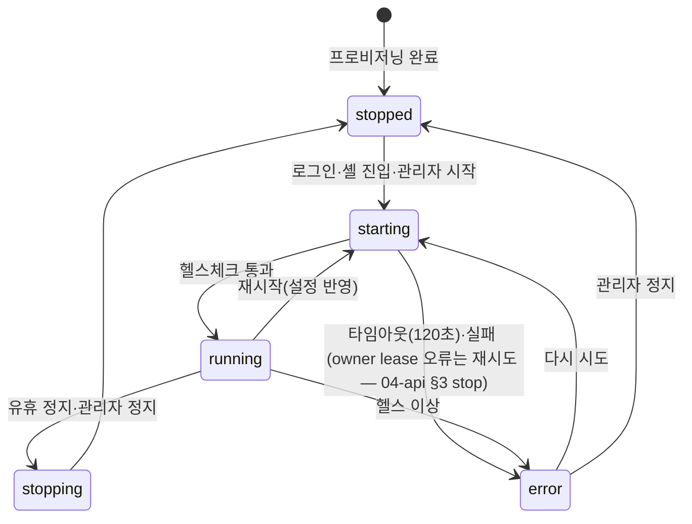
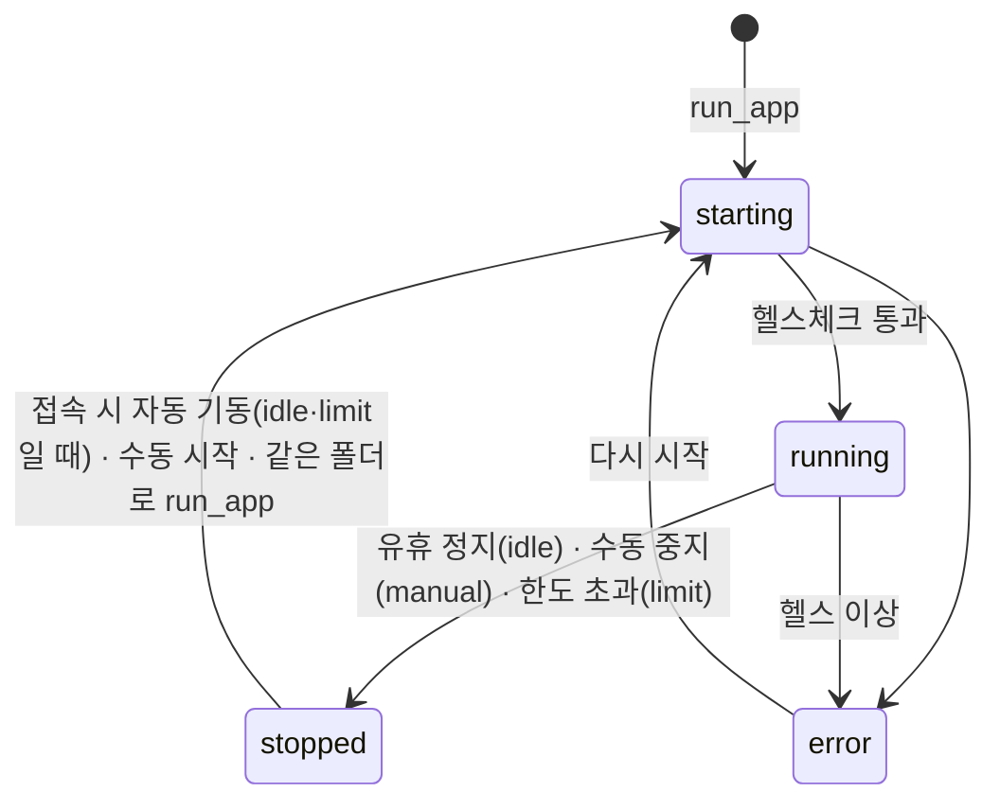
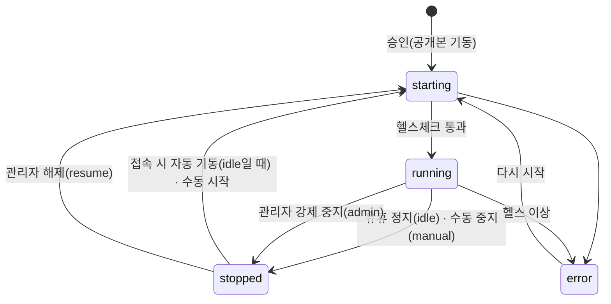
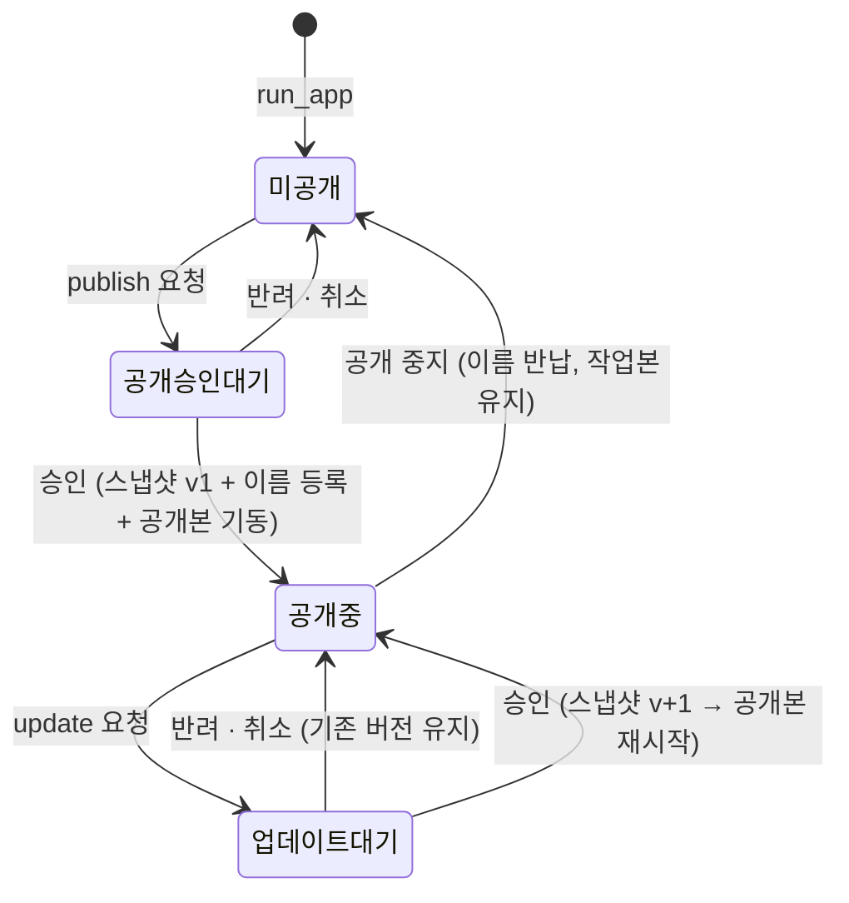

# 03. 데이터 모델 (ERD)

DB는 PostgreSQL 16 하나(`apps/api`만 접근). 마이그레이션은 Drizzle로 관리하고, 이 문서가 스키마의 기준이다.

## 공통 규칙

- PK는 `id uuid` (UUIDv7, 앱에서 생성 — 시간순 정렬 가능). 사람이 읽는 식별자(팀 이름, 패키지 이름)는 별도 `name` 컬럼 + unique.
- 모든 테이블에 `created_at timestamptz not null default now()`. 수정되는 테이블은 `updated_at`.
- 상태값은 Postgres enum 대신 `text + check` 제약(값 목록은 `02-design-system.md` 상태 표와 `packages/shared` 상수가 기준). enum 변경 마이그레이션 부담을 줄이기 위해서다.
- 삭제: 사용자는 삭제 없이 비활성화. 팀·앱은 `deleted_at` 소프트 삭제. 나머지는 실제 삭제.
- 비밀값: MCP 비밀값은 **저장하지 않는다**. 공용 API 키·팀 Gateway 비밀번호는 `APP_ENCRYPTION_KEY`(환경변수)로 AES-256-GCM 암호화해 `*_enc bytea`에 저장.

## ERD

```mermaid
erDiagram
  departments ||--o{ departments : parent_of
  departments ||--o{ users : has
  users ||--o{ auth_identities : has
  users ||--o{ sessions : has
  users ||--o{ memberships : joins
  teams ||--o{ memberships : has
  teams ||--o{ team_agents : assigned
  agent_templates ||--o{ team_agents : used_by
  teams ||--o{ apps : runs
  users ||--o{ apps : creates
  apps ||--o{ deploy_requests : has
  apps ||--o{ app_versions : publishes
  names |o--o| teams : reserves
  names |o--o| apps : reserves
  teams ||--o{ drive_events : logs
  teams ||--o{ trash_items : holds
  users ||--o{ mcp_packages : owns
  mcp_packages ||--o{ mcp_versions : has
  mcp_packages ||--o{ mcp_installs : installed_as
  mcp_versions ||--o{ mcp_installs : pinned
  teams ||--o{ mcp_installs : has
  users ||--o{ posts : writes
  users ||--o{ notifications : receives
  users ||--o{ audit_events : acts
  teams ||--o{ team_presence : tracks
  teams ||--o{ usage_samples : measured

  departments { uuid id PK; text code UK; text name; uuid parent_id FK; uuid head_user_id FK; text status }
  users { uuid id PK; text email UK; text name; uuid department_id FK; text title; text platform_role; text status; int linux_uid UK }
  teams { uuid id PK; text name UK; text display_name; text container_status; int linux_gid UK; jsonb resource_limits }
  memberships { uuid team_id PK,FK; uuid user_id PK,FK; text team_role }
  agent_templates { uuid id PK; text name; int version; jsonb spec }
  team_agents { uuid team_id PK,FK; uuid template_id PK,FK; int applied_version; text apply_status }
  apps { uuid id PK; uuid team_id FK; uuid creator_id FK; text slug; text work_status; text public_name; int public_version; text public_status }
  app_versions { uuid app_id PK,FK; int version PK; text snapshot_path }
  deploy_requests { uuid id PK; uuid app_id FK; text kind; text requested_name; text status }
  names { text name PK; text kind; uuid owner_id }
  mcp_packages { uuid id PK; text name UK; uuid owner_id FK; text status; bool is_default }
  mcp_versions { uuid id PK; uuid package_id FK; text version; text status; jsonb manifest; jsonb tools }
  mcp_installs { uuid id PK; uuid team_id FK; text source; uuid package_id FK; uuid version_id FK; text status }
```

## 테이블 정의

### 사람과 인증

#### `users`

| 컬럼 | 타입 | 제약 | 설명 |
|---|---|---|---|
| id | uuid | PK | |
| email | text | unique, not null, 소문자 저장 | 회사 이메일. **사용자 식별자**(나중 SSO 연결 키). 생성 후 변경 불가(v1) |
| name | text | not null | 표시 이름 |
| department_id | uuid | FK departments, null 허용 | 소속 부서(하나). 생성 화면에서는 필수, DB는 null 허용(가져오기 중간 상태·시스템 계정) |
| title | text | | 직위·직책(자유 입력) |
| employee_no | text | unique, null 허용 | 사번. SSO·인사 연동 시 매칭 키 후보 |
| platform_role | text | `admin` \| `user`, default `user` | |
| status | text | `active` \| `disabled` | |
| password_hash | text | null 허용 | argon2id. SSO 전용 사용자는 null |
| must_change_password | bool | default true | 생성·초기화 시 true |
| password_changed_at | timestamptz | | |
| linux_uid | int | unique, not null | 20000부터 순차 할당. 개인 드라이브 소유자 |
| last_login_at | timestamptz | | |
| created_by | uuid | FK users | |

#### `auth_identities` (SSO 자리 — v1은 `local`만)

| 컬럼 | 타입 | 설명 |
|---|---|---|
| id | uuid PK | |
| user_id | uuid FK users | |
| provider | text | `local` \| `sso` (나중: `oidc:kcc` 등) |
| subject | text | provider 안의 식별자. local은 email |
| unique(provider, subject) | | |

#### `sessions`

| 컬럼 | 타입 | 설명 |
|---|---|---|
| id | uuid PK | |
| token_hash | bytea unique | 쿠키 값의 SHA-256. 원문은 저장하지 않음 |
| user_id | uuid FK | |
| created_at, last_seen_at, expires_at | timestamptz | 유휴 만료 12시간, 절대 만료 7일(제안) |
| ip | inet | |
| user_agent | text | |
| revoked_at | timestamptz | 로그아웃·비활성화·비밀번호 변경 시 |

첫 로그인 설정 전용 세션(`06-auth.md` §2)은 컬럼을 두지 않고 `users.must_change_password`로 판단한다. CSRF 토큰도 저장하지 않고 세션 id의 HMAC으로 계산한다(2단계 결정).

#### `login_attempts`

| 컬럼 | 타입 | 설명 |
|---|---|---|
| id | bigserial PK | |
| email | text | 입력된 값(존재하지 않아도 기록) |
| ip | inet | |
| success | bool | |
| created_at | timestamptz | 인덱스 (email, created_at), (ip, created_at) |

### 조직

#### `departments`

| 컬럼 | 타입 | 설명 |
|---|---|---|
| id | uuid PK | |
| code | text unique | 부서 코드(사내 인사 코드). CSV 가져오기·SSO 연동의 매칭 키. 없으면 자동 생성(`D0001`) |
| name | text | 부서명 |
| parent_id | uuid FK departments | null = 최상위 |
| path | ltree 또는 text | 조상 경로(`root.d0001.d0012`). 하위 포함 검색용. 이동 시 하위 전부 갱신 |
| depth | int | 0부터 |
| sort_order | int | 같은 상위 안 정렬 |
| head_user_id | uuid FK users | 부서장(선택) |
| status | text | `active` \| `archived` |
| source | text | `manual` \| `csv` \| `sso`(나중) — 마지막으로 바꾼 출처 |
| updated_at | timestamptz | |

규칙:
- 깊이 제한 없음(`parent_id` + `path`). 단 안전장치로 **최대 깊이 10단계**(`depth` 0~9, 플랫폼 설정 `org.max_depth`). 추가·이동·가져오기 모두 검사하며, 이동은 옮기는 부서의 하위 중 가장 깊은 부서까지 포함해 계산
- 순환 금지(자기 하위로 이동 불가) — api에서 검사
- 보관은 구성원 0명 + 활성 하위 부서 0개일 때만. 삭제 없음
- "하위 포함" 조회는 `path` 접두어 검색(`ltree` 확장 `<@` 연산자 권장)
- 부서는 권한을 주지 않는다(v1). 팀·드라이브·앱 권한은 여전히 팀 멤버십으로만 판단. v2 지식 권한에서 처음 쓴다

#### `import_jobs` — CSV 가져오기 기록

| 컬럼 | 타입 | 설명 |
|---|---|---|
| id | uuid PK | |
| kind | text | `departments` \| `users` |
| status | text | `previewed` \| `applied` \| `cancelled` |
| file_name | text | |
| summary | jsonb | `{added, updated, unchanged, errors}` |
| rows | jsonb | 미리보기 행별 결과(동작·변경 칸·오류 사유). 적용 후 30일 뒤 삭제 |
| created_by | uuid | |
| applied_at | timestamptz | |

미리보기는 이 행을 만들고, 적용은 같은 id로 실행한다(미리보기 이후 데이터가 바뀌었으면 `409`로 다시 미리보기 요구). 초기 비밀번호는 **저장하지 않고** 적용 응답에서만 한 번 CSV로 돌려준다.

### 팀

#### `names` — 1단계 서브도메인 네임스페이스

| 컬럼 | 타입 | 설명 |
|---|---|---|
| name | text PK | 소문자·숫자·하이픈, 3~30자, `--` 금지, 하이픈으로 시작·끝 금지 |
| kind | text | `team` \| `public_app` \| `reserved` |
| owner_id | uuid | teams.id 또는 apps.id (reserved는 null) |

팀 생성·Public 승인 시 같은 트랜잭션에서 insert. PK 충돌 = 이름 중복. 예약어는 시드로 `reserved` 행 삽입(`05` 문서 목록).

#### `teams`

| 컬럼 | 타입 | 설명 |
|---|---|---|
| id | uuid PK | |
| name | text unique | 서브도메인. `names`에 `team`으로 등록 |
| display_name | text | 화면 표시 이름 |
| container_status | text | `stopped` \| `starting` \| `running` \| `stopping` \| `error` |
| provision_stage | text | `name` \| `storage` \| `container` \| `default_mcp` \| `done` \| `failed` — A-04 진행 표시(`team.provision` 이벤트로 갱신, 3단계 추가) |
| container_status_at | timestamptz | 상태가 마지막으로 바뀐 시각(`TeamStatus.since`, 기동 지연 감지) — 2단계 추가 |
| container_error | text | 마지막 오류 요약 |
| container_id | text | Docker 컨테이너 ID(참고용) |
| linux_gid | int unique | 30000부터. 팀 공유 폴더 그룹 |
| resource_limits | jsonb | `{cpu: 2, memoryMb: 4096, diskGb: 20}` — null이면 플랫폼 기본값 |
| gateway_password_enc | bytea | 플랫폼 내부 호출용 팀 Gateway 비밀번호(암호화) |
| config_version | int | orchestrator가 마지막으로 쓴 openclaw.json 버전 |
| last_active_at | timestamptz | 마지막 heartbeat |
| deleted_at | timestamptz | |

#### `memberships`

| 컬럼 | 타입 | 설명 |
|---|---|---|
| team_id, user_id | uuid | 복합 PK |
| team_role | text | `team_admin` \| `member` |
| added_by | uuid FK users | |

#### `team_presence` — 참조 카운팅

| 컬럼 | 타입 | 설명 |
|---|---|---|
| team_id, session_id | uuid | 복합 PK |
| user_id | uuid | |
| last_seen_at | timestamptz | heartbeat마다 갱신 |

접속자 수 = `last_seen_at > now() - 2분`인 행 수. 유휴 정지 워커가 1분마다 `last_active_at < now() - 유휴 정지 시간`인 running 팀을 정지 요청.

### 에이전트

#### `agent_templates`

| 컬럼 | 타입 | 설명 |
|---|---|---|
| id | uuid PK | |
| name | text | |
| icon | text | 이모지 |
| description | text | |
| version | int | 저장할 때마다 +1 |
| spec | jsonb | 아래 구조 |
| created_by, updated_by | uuid | |

`spec` 구조 (openclaw.json 변환은 orchestrator 담당, 아래 대응표 — spike 04):

```json
{
  "model": { "id": "claude-sonnet-...", "reasoning": "medium" },
  "instructions": "마크다운 지시문",
  "skills": [{ "name": "meeting-notes", "source": "bundled|upload", "ref": "..." }],
  "defaultMcp": ["pkg-name"],
  "tools": { "allow": ["..."], "deny": ["..."] }
}
```

| `spec` | OpenClaw (2026.9.7) | 반영 |
|---|---|---|
| (템플릿) | `agents.entries.<agentId>` — agentId는 `kacp-` + 템플릿 id 끝 12자. `workspace`는 `<stateDir>/workspace-<agentId>`로 명시 | `config.patch`(3단계 구현). 기본 에이전트는 `main` 그대로 — 2026.9.7에서 `default: true`는 레거시 표시라 doctor가 `talk.agentId` 등 명시 소유자로 바꾼다. 템플릿 에이전트는 Control UI에서 골라 쓴다 |
| name, icon | `agents.entries.<id>.name`, `.identity.emoji` | config.patch |
| description | 없음 | DB에만 |
| `model.id` | `agents.entries.<id>.model` (`"provider/model"`) | config.patch. **provider 접두사 포함**으로 저장 |
| `model.reasoning` | `agents.entries.<id>.thinkingDefault` | config.patch (`reasoningDefault`는 추론 표시 여부라 다른 키) |
| `instructions` | 설정 키 없음 → 워크스페이스 `AGENTS.md` | orchestrator가 파일로 기록 |
| `skills[]` | `SKILL.md`가 든 폴더(`<workspace>/skills/<name>/` 또는 `skills.load.extraDirs`) + `agents.entries.<id>.skills` 허용 목록 | 업로드 스킬은 플랫폼 공용 폴더(ro)를 extraDirs로 |
| `defaultMcp[]` | `mcp.servers.<name>` (Gateway 전체) | config.patch |
| `tools` | `agents.entries.<id>.tools.{profile, allow, deny}` | config.patch |

#### `team_agents`

| 컬럼 | 타입 | 설명 |
|---|---|---|
| team_id, template_id | uuid | 복합 PK |
| applied_version | int | 팀에 실제 반영된 템플릿 버전 |
| apply_status | text | `pending` \| `applied` \| `failed` |
| apply_error | text | |
| applied_at | timestamptz | 마지막 반영 시각(A-05 할당 탭) |
| assigned_by | uuid | |

템플릿 버전 > applied_version이면 `pending`. 팀이 꺼져 있으면 다음 기동 때 반영하고 `applied`로.

### 드라이브

파일 자체는 디스크(`/data/teams/{team}/drive/...`)가 원본이다. DB에는 기록만 둔다.

#### `drive_events`

| 컬럼 | 타입 | 설명 |
|---|---|---|
| id | bigserial PK | |
| team_id | uuid | |
| space | text | `me` \| `shared` |
| owner_user_id | uuid | space=me일 때 드라이브 주인 |
| path | text | 공간 루트 기준 상대 경로(이동 후 경로) |
| prev_path | text | 이동·이름 변경 전 |
| action | text | `create` \| `update` \| `rename` \| `move` \| `copy` \| `trash` \| `restore` \| `delete` |
| actor_kind | text | `user` \| `agent` \| `system` |
| actor_user_id | uuid | user면 그 사람. agent면 null(호출자 신원을 알 수 없음 — spike 05) |
| created_at | timestamptz | 인덱스 (team_id, space, path) |

"만든 사람" = 해당 path의 가장 이른 `create` 이벤트. 없으면 "기록 없음".
샌드박스·에이전트가 직접 쓴 파일(4단계 결정 — **지연 조정**): API를 거치지 않으므로, api가 `list`·`meta` 때 팀 공유 공간에서 이벤트가 하나도 없는 파일에 `create`(`actor_kind=agent`), 마지막 이벤트 시각보다 mtime이 새로운 파일에 `update`(`actor_kind=agent`)를 만든다. 감시(inotify)는 쓰지 않는다(팀 컨테이너 밖에서 볼 수 없고 OpenClaw를 고치지 않음). 개인 공간은 에이전트가 쓰지 않으므로 조정하지 않는다.

이동·이름 변경 때는 그 경로와 하위의 기존 이벤트 `path`도 새 경로로 바꾼다(기록이 파일을 따라감).

#### `trash_items`

| 컬럼 | 타입 | 설명 |
|---|---|---|
| id | uuid PK | 휴지통 폴더 안 이름으로도 사용 |
| team_id, space, owner_user_id | | |
| original_path | text | |
| is_dir | bool | |
| size_bytes | bigint | |
| deleted_by | uuid | |
| deleted_at | timestamptz | |
| purge_after | timestamptz | 기본 30일 뒤 |

### 앱

#### `apps`

앱 하나는 **작업본(work, Private)** 과 **공개본(public, Public)** 두 사본을 가진다(`01-screens.md` §2-1). 사본별 상태를 따로 둔다.

| 컬럼 | 타입 | 설명 |
|---|---|---|
| id | uuid PK | |
| team_id | uuid FK | |
| creator_id | uuid FK users, nullable | v1 앱은 전부 `run_app`으로 생기므로 항상 null(= 에이전트(팀), spike 05). 사람이 만든 앱(자기 앱)은 v2 자리 |
| slug | text | 팀 안에서 unique. 작업본 주소 `{slug}--{team}` |
| source_space, source_path | text | 원본 폴더. run_app이면 `source_space = shared`(팀 공유 드라이브). unique(team_id, source_space, source_path) — 같은 폴더로 다시 run_app하면 새 앱이 아니라 작업본 재시작 |
| run_spec | jsonb | `{command, port, runtime, env}` — platform-mcp run_app 입력 |
| resource_limits | jsonb | null이면 기본값(두 사본 공통) |
| **작업본** | | |
| work_status | text | `app_status`: `starting` \| `running` \| `stopped` \| `error` |
| work_stop_reason | text | `idle` \| `limit` \| `manual` (stopped일 때) |
| work_status_detail | text | |
| work_container_id | text | |
| work_last_accessed_at | timestamptz | forward-auth가 갱신(1분에 한 번만 쓰기) |
| work_started_at | timestamptz | |
| **공개본** (공개된 적 없으면 전부 null) | | |
| public_name | text | 공개 주소 이름. `names`에 `public_app`으로 등록 |
| public_version | int | 승인될 때마다 +1 |
| public_status | text | `app_status` 값, null = 미공개 |
| public_stop_reason | text | `idle` \| `manual` \| `admin` (stopped일 때) |
| public_status_detail | text | 강제 중지 사유 등 |
| public_container_id | text | |
| public_snapshot_path | text | 현재 버전 스냅샷 위치 |
| public_published_at | timestamptz | 현재 버전 승인 시각 |
| public_approved_by | uuid | |
| public_last_accessed_at | timestamptz | |
| deleted_at | timestamptz | |
| unique(team_id, slug) | | |

파생 규칙:
- "공개 중" = `public_version is not null`. 공개 중지하면 public_* 을 모두 null로 되돌리고 `names` 행 삭제.
- 사본별 데이터 폴더: `/data/apps/{id}/work-data`, `/data/apps/{id}/public-data`(`05` 문서). 두 데이터는 섞지 않는다. 공개 중지 시 public-data는 `backups`로 이동 후 30일 보관.
- `stop_reason`은 `idle` \| `limit` \| `manual` \| `admin` 넷뿐이다(오류는 `status = error`로만 표시). `limit`은 작업본만, `admin`은 공개본만.
- "잠듦" 표시 = `status = stopped and stop_reason in (idle, limit)`(`02-design-system.md` §6). 이 상태는 접속 시 자동 기동 대상.

#### `deploy_requests`

| 컬럼 | 타입 | 설명 |
|---|---|---|
| id | uuid PK | |
| app_id | uuid FK | |
| kind | text | `publish`(첫 공개) \| `update`(공개본 갱신) |
| requested_by | uuid, nullable | 요청을 누른 사람. null = 에이전트(팀)(platform-mcp `deploy_app`) |
| requested_name | text | publish일 때 공개 주소 이름(요청 시 중복 검사, 승인 시 `names` 등록). update면 null |
| reason | text | publish: 공개 이유 / update: 변경 내용 |
| from_version | int | update일 때 요청 시점의 공개본 버전 |
| diff_summary | jsonb | update일 때 요청 시점 계산한 파일 변경 `{added:[], modified:[], removed:[]}` (승인 화면용) |
| status | text | `pending` \| `approved` \| `rejected` \| `cancelled` |
| decided_by | uuid | |
| decided_at | timestamptz | |
| decision_note | text | 반려 사유(필수) / 승인 메모 |
| approved_version | int | 승인으로 만들어진 공개본 버전 |

앱당 `pending`은 하나만(부분 unique 인덱스). 공개 중이 아닌 앱은 `update`를 만들 수 없고, 공개 중인 앱은 `publish`를 만들 수 없다.

#### `app_versions` — 공개본 버전 기록

| 컬럼 | 타입 | 설명 |
|---|---|---|
| app_id, version | | 복합 PK |
| snapshot_path | text | `/data/apps/{id}/snapshots/{version}` |
| request_id | uuid FK deploy_requests | |
| approved_by, approved_at | | |

스냅샷은 최근 3개 버전만 보관(롤백은 v1.1).

### MCP

#### `mcp_packages`

| 컬럼 | 타입 | 설명 |
|---|---|---|
| id | uuid PK | |
| name | text unique | 매니페스트 이름 |
| owner_id | uuid FK users, nullable | 처음 올린 사람. null = platform-mcp(시드) |
| display_name, summary, category, icon | text | 최신 게시 버전 매니페스트에서 복사(게시 전에는 최근 업로드) |
| status | text | `active` \| `suspended` |
| is_default | bool | 전사 기본 MCP(새 팀 자동 설치) |
| is_platform | bool | platform-mcp(제거 불가) |
| latest_version_id | uuid | 최신 `published` 버전 |
| install_count | int | 캐시 |

#### `mcp_versions`

| 컬럼 | 타입 | 설명 |
|---|---|---|
| id | uuid PK | |
| package_id | uuid FK | |
| version | text | semver. unique(package_id, version) |
| uploaded_by | uuid | |
| status | text | `uploaded` → `validating` → `building` → `scanning` → `testing` → `in_review` → `published`, 또는 `failed` / `rejected` / `superseded` |
| failed_stage | text | 실패한 단계: `validate` \| `build` \| `scan` \| `test`. 02 MCP 버전 스테퍼의 검증·빌드·보안 스캔·테스트 단계에 1:1 대응. v1 검증 실패는 업로드 `422`로 끝나 행이 생기지 않는다 |
| status_detail | text | 실패 원인(한국어) |
| stage_at | timestamptz | 현재 단계 시작 시각(25분 넘게 멈추면 failed) |
| manifest | jsonb | `platform-plugin.yaml` 파싱 결과 |
| readme | text | |
| tools | jsonb | 테스트에서 추출한 `tools/list` |
| scan_summary | jsonb | `{critical, high, medium, low}` |
| scan_findings | jsonb | 심각한 순 최대 200개 `[{severity, pkg, id, title}]` |
| published_at | timestamptz | |

파일 경로는 저장하지 않고 이름·버전으로 정한다: `/data/mcp/{pkg}/{ver}/` 아래 `source.zip`(원본) · `src/`(풀어 둔 소스 = 빌드 컨텍스트) · `build.log` `scan.log` `test.log` · `scan.json`(Trivy 원본).
| image_ref | text | 빌드된 이미지 태그 |
| reviewed_by, reviewed_at, review_note | | |

빌드 대기열 = `status='uploaded'`인 행을 `created_at` 순으로 한 번에 하나(진행 중 단계가 없을 때 `uploaded → validating` 조건부 update로 하나만 잡는다). 새 버전이 게시되면 그 패키지의 모든 설치가 새 버전으로 바뀐다(비밀값 유지, 버전 고정은 v2).

#### `mcp_installs`

| 컬럼 | 타입 | 설명 |
|---|---|---|
| id | uuid PK | |
| team_id | uuid FK | |
| source | text | `default` \| `market` \| `manual` |
| package_id, version_id | uuid | market/default일 때 |
| manual_name, manual_url | text | manual일 때 |
| server_key | text | 팀 `mcp.servers`의 키. unique(team_id, server_key) |
| status | text | `installing` \| `installed` \| `error` \| `removing` |
| status_detail | text | |
| secret_names | text[] | 입력된 비밀값 **이름**만(값 없음). 직접 추가는 헤더 이름 |
| installed_by | uuid, nullable | null = 시스템(전사 기본 MCP·platform-mcp 자동 설치). 화면 표시 "시스템" |
| last_checked_at | timestamptz | Gateway 동기화 워커가 마지막으로 확인한 시각 |

Gateway 동기화 워커는 실행 중인 팀의 `config.get` 결과로 이 테이블을 맞춘다. Gateway에만 있고 DB에 없는 항목은 `source=manual`로 추가(Control UI에서 직접 넣은 경우).

### 커뮤니티·알림·기록·설정

#### `posts`

| 컬럼 | 타입 | 설명 |
|---|---|---|
| id | uuid PK | |
| author_id | uuid | |
| category | text | `notice` \| `question` \| `tip` \| `mcp_share` \| `app_share` |
| title | text | |
| body_md | text | |
| attached_package_id | uuid | null 허용 |
| attached_app_id | uuid | Public 앱만 |
| updated_at, deleted_at | timestamptz | |

#### `notifications`

| 컬럼 | 타입 | 설명 |
|---|---|---|
| id | uuid PK | |
| user_id | uuid | 받는 사람 |
| type | text | `deploy_approved` `deploy_rejected` `mcp_build_succeeded` `mcp_build_failed` `mcp_approved` `mcp_rejected` `team_container_error` `agent_assignment_changed` `admin_review_requested` `app_force_stopped` |
| title | text | |
| link | text | 클릭 시 이동 경로 |
| payload | jsonb | |
| read_at | timestamptz | |

#### `audit_events`

| 컬럼 | 타입 | 설명 |
|---|---|---|
| id | bigserial PK | |
| actor_id | uuid | null = 시스템 |
| action | text | `user.create` `user.disable` `user.reset_password` `team.create` `team.delete` `membership.add` `membership.remove` `department.create` `department.update` `department.move` `department.archive` `user.department_change` `import.apply` `agent.assign` `agent.unassign` `template.update` `container.start` `container.stop` `container.restart` `resources.update` `deploy.approve` `deploy.reject` `app.force_stop` `app.force_resume` `team.update` `membership.role_change` `user.enable` `mcp.resume` `mcp.set_default` `mcp.approve` `mcp.reject` `mcp.suspend` `mcp.install` `mcp.remove` `mcp.manual_add` `mcp.secrets_update` `settings.update` `template.create` `template.delete` `user.update` `department.unarchive` |
| target_type | text | `user` `department` `team` `app` `mcp_package` `mcp_version` `template` `settings` `import` |
| target_id | text | |
| team_id | uuid | 관련 팀(필터용) |
| detail | jsonb | 변경 전후 요약(비밀값 제외) |
| ip | inet | |
| created_at | timestamptz | |

#### `platform_settings` — 키-값

| key | value 예 |
|---|---|
| `models.allowed` | `[{id, label, provider, default}]` |
| `models.api_keys` | `{anthropic: <enc>}` (값은 bytea 컬럼 `value_enc`) |
| `limits.team_default` | `{cpu: 2, memoryMb: 4096, diskGb: 20}` |
| `limits.app_default` | `{cpu: 0.5, memoryMb: 512}` |
| `limits.mcp_default` | `{cpu: 0.25, memoryMb: 256}` |
| `ops.idle_stop_minutes` | `30` (팀 컨테이너) |
| `ops.app_idle_stop_minutes` | `{work: 30, public: 120}` |
| `ops.max_running_work_apps_per_team` | `5` |
| `ops.capacity_warn` | `{warn: {cpu: 80, memory: 85, disk: 80}, danger: {cpu: 90, memory: 95, disk: 90}}` — A-01 노랑(warn)·빨강(danger) 두 단계 |
| `ops.trash_retention_days` | `30` |
| `names.reserved_extra` | `["hr", "it"]` |
| `org.max_depth` | `10` |

컬럼: `key text PK, value jsonb, value_enc bytea, updated_by, updated_at`.

#### `usage_samples` — 대시보드용

| 컬럼 | 타입 | 설명 |
|---|---|---|
| ts | timestamptz | 1분 간격 |
| target_type | text | `vm` \| `team` \| `app` \| `mcp` |
| target_id | text | vm은 `host` |
| cpu_pct, mem_bytes, mem_limit_bytes | | |
| disk_bytes | bigint | vm·팀만 |

7일 보관 후 삭제(cAdvisor + Prometheus 전환 시 이 테이블은 폐기).

## 상태 전이

### 팀 컨테이너



- "헬스체크 통과" = Docker health `healthy`(컨테이너 안 `GET 127.0.0.1:18789/healthz`). orchestrator가 healthcheck 주기를 재정의해야 120초 안에 판정된다(`04-api.md` §3 `ensure-running`). VM 실측 약 25초(spike 06).
- v1은 예약 기동이 없다. 팀 컨테이너가 잠든 동안 OpenClaw 예약 작업(cron — 예: memory-core가 기동 때 만드는 dreaming 작업)은 돌지 않는다. 예약 작업이 필요해지면 그때 기동 트리거를 추가한다.

### 앱 — 작업본



### 앱 — 공개본 컨테이너



### 앱 — 공개 흐름



상태 이름은 `02-design-system.md` §6 `AppCopyBadge`·앱 목록 필터 문구(미공개 / 공개 승인 대기 / 공개 중 / 업데이트 대기)와 같다(다이어그램에서는 띄어쓰기를 뺐다).

공개본 컨테이너 자체의 상태(`public_status`)는 위 "공개본 컨테이너" 전이를 따른다. 관리자 강제 중지(`admin`)는 접속해도 자동 기동하지 않고, 관리자 해제로만 다시 켜진다.

### MCP 버전

```mermaid
stateDiagram-v2
  [*] --> uploaded
  uploaded --> validating --> building --> scanning --> testing --> in_review
  validating --> failed
  building --> failed
  scanning --> failed: Critical 발견(제안: 차단)
  testing --> failed
  in_review --> published: 관리자 승인
  in_review --> rejected: 관리자 반려
  published --> superseded: 새 버전 게시
```
