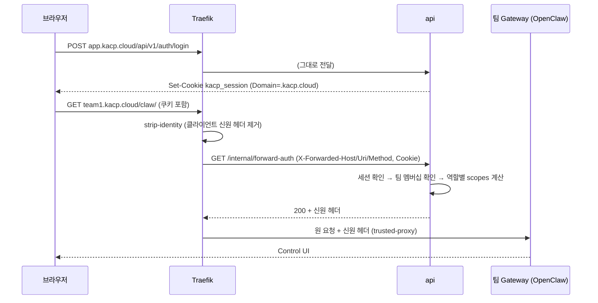

# 06. 로그인 설계

v1은 **플랫폼 자체 계정**이다. 관리자가 계정을 만들고 팀에 배정한다. 사내 SSO는 나중에 붙이며, 사용자 식별자는 처음부터 **회사 이메일**로 고정한다.

## 1. 구성 요소



## 2. 계정

- 생성: 플랫폼 관리자만(A-03). 이메일(소문자 정규화), 이름, 역할, 초기 비밀번호(자동 생성 16자 또는 직접 입력). `must_change_password = true`.
- 초기 비밀번호는 생성 응답에서 **한 번만** 반환, DB에는 해시만.
- 첫 로그인: 로그인은 성공하지만 세션이 `pw_setup_only` 상태(= 사용자의 `must_change_password`가 true인 동안 — 별도 컬럼 없음). 이 세션으로는 `POST /auth/password`, `GET /auth/me`, `POST /auth/logout`만 허용, forward-auth는 거부(→ C-02로 리다이렉트).
- 비밀번호 초기화: 관리자가 새 임시 비밀번호 발급 → `must_change_password = true` + 그 사용자 **모든 세션 폐기**.
- 비활성화: `status = disabled` + 모든 세션 폐기 + 팀 presence 제거. 로그인 시 "비활성화된 계정이에요. 관리자에게 문의하세요".
- 비밀번호 규칙: 10자 이상, 영문·숫자 포함, 이메일 local-part 포함 금지, 직전 비밀번호와 다름. 해시는 argon2id(m=64MB, t=3, p=1). VM(n4-standard-8) verify 41ms로 확정(spike 06) — 300ms 목표보다 충분히 빠르고, 메모리를 더 올리면 동시 로그인 메모리(64MB × 동시 수)가 먼저 부담이 된다.

## 3. 세션

| 항목 | 값 |
|---|---|
| 쿠키 이름 | `kacp_session` |
| 값 | 32바이트 랜덤(base64url). DB에는 SHA-256만 저장 |
| 속성 | `Domain=.kacp.cloud; Path=/; HttpOnly; Secure; SameSite=Lax` |
| 유휴 만료 | 12시간 (요청마다 `last_seen_at` 갱신 — 1분에 한 번만 쓰기) |
| 절대 만료 | 7일 |
| 폐기 | 로그아웃, 비밀번호 변경(현재 세션 제외 전부), 초기화·비활성화(전부) |

- 로그아웃 후에도 팀 호스트에 Control UI service worker가 남아 요청을 보낸다(spike 01 관찰, forward-auth가 403으로 막음). **2단계 결정: `Clear-Site-Data`는 보내지 않는다.** 이 헤더는 응답을 받은 origin만 지우는데 로그아웃은 `app` 호스트에서 일어나므로 팀 호스트를 지울 수 없고, 남은 service worker 요청은 forward-auth가 401/302로 막는다.

- **CSRF**: 상태를 바꾸는 API는 `X-KACP-CSRF` 헤더 필수(값은 `GET /auth/me` 응답의 `csrfToken`, 세션별 — `HMAC-SHA256(HKDF(APP_ENCRYPTION_KEY), session id)`로 계산해 저장하지 않음). `SameSite=Lax` + 커스텀 헤더 + CORS 제한으로 방어.
- **CORS**: api는 `Origin`이 `https://app.kacp.cloud` 또는 존재하는 팀 호스트(`https://{team}.kacp.cloud`)일 때만 `Access-Control-Allow-Credentials: true`.
- 앱 호스트(작업본 `앱--팀`, 공개본 공개 주소)에서 오는 요청에는 CORS를 **허용하지 않는다** — 사원이 만든 앱이 플랫폼 API를 사용자 권한으로 호출하지 못하게.
- 앱이 같은 `.kacp.cloud` 쿠키를 받는 문제: 앱 컨테이너로 가는 요청에서 Traefik이 forward-auth **뒤에** `kacp_session` 쿠키만 제거한다(`strip-session-cookie` 로컬 플러그인, 앱 라우터에만 — spike 03 확인). 앱은 신원 헤더(`X-KACP-User-Email` 등)와 앱 자체 쿠키만 받는다.

## 4. 로그인 시도 제한

- 같은 이메일로 15분 안에 5회 실패 → 그 이메일 15분 잠금
- 같은 IP로 15분 안에 30회 실패 → 그 IP 15분 잠금(사무실 NAT 고려해 넉넉히)
- 잠금 중에는 비밀번호가 맞아도 실패 응답(`429`, "잠시 후 다시 시도하세요")
- 존재하지 않는 이메일도 같은 시간·같은 응답(더미 해시 검증)

## 5. forward-auth

`GET http://api:3000/internal/forward-auth` — Traefik만 호출(`kacp-core`가 아니라 `kacp-edge`에서 오지만 내부 경로는 외부 라우터에 없음).

### 입력

`X-Forwarded-Host`, `X-Forwarded-Uri`, `X-Forwarded-Method`, `Cookie`, `Accept`, `Upgrade`

### 판단 순서

1. 호스트 분류: `app` / 팀 호스트 / 작업본(`slug--team`) / 공개본(공개 주소) / 알 수 없음
2. 알 수 없음 → `200`(헤더 없음). web이 404 화면을 그린다.
3. 세션 없음·만료 →
   - 브라우저 탐색(`Accept`에 `text/html`, `Upgrade` 없음) → `302 https://app.kacp.cloud/login?next={원래 URL}`
   - 그 외(XHR, WebSocket) → `401`
   - forward-auth가 주는 `Location`은 **항상 절대 URL**. Traefik forwardAuth는 상대 경로를 인증 서버 주소(`http://api:3000`) 기준으로 바꿔 버린다(spike 01)
4. `pw_setup_only` 세션 → `302 /password/setup`
5. 권한:
   - 팀 호스트·작업본(`앱--팀`) → 그 팀 멤버십 필요, 없으면 `403`(브라우저면 `302 https://app.kacp.cloud/forbidden?team=...`)
   - 공개본(공개 주소) → 로그인만 필요
   - 앱 호스트면 그 사본의 마지막 접속 시각을 갱신(유휴 정지 판단용, 1분에 한 번)
6. 성공 → `200` + 아래 헤더

### 응답 헤더 (Traefik `authResponseHeaders`)

| 헤더 | 값 | 대상 |
|---|---|---|
| `X-Forwarded-User` (trusted-proxy 사용자 헤더, `trustedProxy.userHeader`) | 사용자 이메일 | 팀 Gateway |
| `X-Openclaw-Scopes` | 팀원: `operator.read,operator.write,operator.approvals,operator.questions` / 팀 관리자: 앞 값 + `,operator.admin` (쉼표 구분) | 팀 Gateway |
| `X-KACP-User-Id` | users.id | 전부 |
| `X-KACP-User-Email` | 이메일 | 전부 |
| `X-KACP-User-Name` | 이름(URL 인코딩) | 전부 |
| `X-KACP-Team` | 팀 이름 | 팀 호스트·작업본 |
| `X-KACP-Team-Role` | `team_admin` \| `member` | 팀 호스트·작업본 |

- `X-Openclaw-Scopes`는 팀 호스트 200 응답에 **항상** 넣는다. 헤더가 없으면 OpenClaw HTTP 경로가 CLI 기본 scope를 적용한다(spike 01, 이미지 코드 확인).
- WebSocket에서 `X-Openclaw-Scopes`는 **상한(cap)일 뿐 권한을 주지 않는다.** 팀 관리자의 admin은 openclaw.json `identityScopes`로 붙는다(§6). 헤더에 admin을 넣는 이유는 HTTP 경로와 상한을 맞추기 위해서다.
- 이 헤더는 `identityScopes`보다 **뒤에 적용되는 최종 상한**이다. 팀원 값을 받은 사람은 `identityScopes`에 admin이 있어도 admin이 붙지 않는다(spike 02). 팀 관리자 지정·해제는 api(이 헤더)와 orchestrator(`identityScopes`)가 **둘 다** 바꿔야 반영되고, 한쪽만 바뀌면 좁은 쪽으로 정해진다.
- 성능: forward-auth는 모든 요청(정적 파일 포함)마다 호출된다. 세션·멤버십은 api 메모리 캐시 10초(세션 폐기·멤버십 변경 시 즉시 무효화).
- WebSocket: forward-auth는 업그레이드 요청에도 적용된다(spike 03: 비로그인 302, 비멤버 403, 멤버 101). Origin 검사(`controlUi.allowedOrigins`)는 업그레이드 다음 Gateway 연결 단계에서 한다. 업그레이드 요청 한 번만 검사된다. Traefik forwardAuth는 인증 요청에서 hop-by-hop 헤더(`Upgrade`·`Connection`)를 뺄 수 있어 api는 `Sec-WebSocket-Version`으로도 WebSocket을 판단한다(2단계). 세션 폐기 시 열린 WS를 끊으려면 팀 Gateway 재접속 유도가 필요 — v1은 "비활성화 즉시 차단"을 팀 컨테이너 재시작 옵션으로 제공(A-03 비활성화 확인창에 체크박스).

## 6. OpenClaw 연동 규칙

- 팀 Gateway는 trusted-proxy 인증만 켠다. `trustedProxies` = Traefik의 `kacp-edge` 네트워크 주소(고정 IP 할당).
- **Gateway 토큰은 쓰지 않는다**(trusted-proxy와 동시 사용 불가).
- 플랫폼 내부 호출(**orchestrator만** → admin-http-rpc `POST /api/v1/admin/rpc`. api는 orchestrator `/internal/gateway/{team}/rpc` 경유)은 팀별 Gateway 비밀번호(`teams.gateway_password_enc`)로 인증. 이 비밀번호는 프로비저닝 때 생성, 브라우저에 절대 노출하지 않음.
  - trusted-proxy 모드에서 비밀번호는 **local-direct**(loopback, `X-Forwarded-*` 없음)일 때만 허용된다. 다른 컨테이너에서 부르면 401(spike 04).
  - 그래서 팀마다 사이드카 `kacp-gwagent-{team}`(`network_mode: container:kacp-team-{team}`)를 붙인다. 사이드카가 `127.0.0.1:18789/api/v1/admin/rpc`를 Bearer 비밀번호로 부르고, orchestrator → 사이드카는 내부 토큰으로 인증한다. **2단계 결정(구현은 3단계)**: 팀별 토큰 `HMAC-SHA256(INTERNAL_TOKEN, "gwagent:" + team)`을 사이드카 환경변수로 주고 `Authorization: Bearer`로 확인한다(저장 없음, 팀 간 재사용 불가). 사이드카 포트는 팀 컨테이너 네트워크 네임스페이스에 열리므로 `kacp-edge`의 다른 컨테이너도 닿을 수 있다 — 토큰이 유일한 방어선이고, 사이드카는 `config.get`·`config.patch`만 중계한다. orchestrator가 사이드카에 닿는 경로(orchestrator를 `kacp-edge`에 붙일지, 팀별 네트워크를 둘지)는 3단계에서 정한다
  - 시드 설정: `plugins.entries.admin-http-rpc.enabled: true`, `gateway.auth.password = {source: "env", provider: "default", id: "OPENCLAW_GATEWAY_PASSWORD"}`(재시작 필요 키라 시드에 넣는다).
  - admin RPC 경로는 basePath와 무관하게 `/api/v1/admin/rpc`다. Traefik은 `/claw`만 Gateway로 보내므로 외부에 노출되지 않는다(spike 04: 브라우저 경로 404).
- `trustedProxy.userHeader: "x-forwarded-user"`, `allowLoopback: false`.
- `deviceAutoApprove.enabled: true` — 사원이 페어링 화면 없이 바로 접속(spike 01 확인). `deviceAutoApprove.scopes`는 기본값(read·write·approvals·questions)을 쓰고 **admin을 넣지 않는다**(모든 사원에게 영구 admin이 된다).
- 팀 관리자 admin: `gateway.auth.identityScopes = {"{이메일}": ["operator.admin"], …}`. 연결 단위로만 붙고 영구 기기 권한은 넓히지 않는다(spike 01 확인). orchestrator가 팀 관리자 지정·해제 때 `config.patch`로 갱신한다(`04-api.md` §3 `apply-config`). 재시작 없이 hot reload되고, 바뀐 사람의 연결만 `4001 gateway policy changed`로 끊겼다가 1초 안에 다시 붙는다 — 이때 forward-auth도 다시 거친다(spike 02).
- **세션 공유 모델 — 팀 채팅 + 개인 대화**: `gateway.roles = {default: "member", definitions: {member: {sessions: {others: "write"}, agents: "*", scopes: ["operator.admin"]}}}` (spike 02).
  - 역할 없이(기본값) 두면 팀원 모두가 서로의 세션을 보고 쓴다(issue #104499는 열려 있음). 역할을 둬야 개인 대화를 숨길 수 있다.
  - 세션 공개 범위 **공유됨 = 팀 채팅**: 팀원 모두 읽고 쓴다. 새 세션의 기본값이다.
  - 세션 공개 범위 **초안 = 개인 대화**: 다른 팀원에게는 목록에서도, 직접 주소(`sessions.resolve` → `No session found`)로도 안 보인다. 새 세션 페이지에서 처음부터 고르거나 나중에 바꾼다. 팀 관리자(admin)는 초안도 본다.
  - `others: "write"`에서는 **읽기 전용·제안 표시가 무시된다**(팀원이 그대로 쓸 수 있음, 문서와 동일). "읽기만 공유"는 v1에서 지원하지 않는다.
  - 기본값을 초안으로 바꾸는 설정은 없다(2026.9.7). 셸·안내 문구에서 "개인 대화는 초안으로"를 알려야 한다(`01-screens.md` U-01).
  - 검토했지만 쓰지 않는 것: `others: "none"`(개인 대화만 가능, 세션 멤버 초대 `session.members.add`도 효과 없음 — 팀 채팅 불가), `view`(쓰기는 본인만).
  - `scopes`는 **상한일 뿐 부여가 아니라** admin까지 열어 둔다. 실제 권한은 기기 자동 승인(팀원 값)과 `identityScopes`(팀 관리자)로 정해진다. 그래서 역할은 하나로 충분하고 `users.setRole`(profile이 첫 로그인 뒤에야 생겨서 별도 호출이 필요)은 쓰지 않는다.
  - 에이전트 세션 도구: `tools.sessions.visibility: "tree"`. 기본값 `all`에서도 요청자 역할 권한 밖의 세션은 안 보였지만(spike 02) 심층 방어로 좁힌다.
  - 공개 접근(Public access) 링크: `/claw/share/session?token=…`. `X-Forwarded-Proto`가 정확히 `https`일 때만 열린다. KACP에서는 이 경로도 forward-auth를 거치므로 팀원만 열 수 있다(spike 07 이후 VM 확인: 팀원 읽기 전용, 비멤버 403). 막지는 않는다.
  - 한계: 세션 목록·대화의 분리이지 사람 간 격리가 아니다. `operator.write`의 Gateway 전역 동작(도구 호출, 감사 진단)은 팀 안에서 공유된다(OpenClaw `operator-scopes` 문서).
- `allowUsers`는 v1에서 비워 둔다. 멤버십은 forward-auth가 막고, 우회 경로는 `trustedProxies`가 막는다(같은 네트워크의 다른 컨테이너 → `proxy_attribution_required`). `openclaw security audit`의 `trusted_proxy_no_allowlist` WARN은 수용한다.
- `controlUi.allowedOrigins` = `https://{team}.kacp.cloud`

## 7. 권한 모델

### 역할

| 역할 | 저장 위치 | 범위 |
|---|---|---|
| 플랫폼 관리자 | `users.platform_role = admin` | 전체 |
| 일반 사용자 | `users.platform_role = user` | 자기 정보, 전사 메뉴 |
| 팀 관리자 | `memberships.team_role = team_admin` | 자기 팀 |
| 팀원 | `memberships.team_role = member` | 자기 팀 |

플랫폼 관리자라도 팀 멤버가 아니면 팀 호스트(에이전트)에는 들어갈 수 없다. 관리자는 A-05에서 팀을 관리하고, 필요하면 자신을 멤버로 추가한다(활동 기록 남음).

### 권한 매트릭스

| 행위 | 팀원 | 팀 관리자 | 플랫폼 관리자 |
|---|---|---|---|
| 자기 팀 에이전트 사용 | ○ | ○ | 멤버일 때 |
| 팀 채팅(공유됨 세션) 읽기·쓰기 | ○ | ○ | 멤버일 때 |
| 남의 개인 대화(초안 세션) 보기 | ✕ | ○ | 멤버일 때(팀 관리자일 때만) |
| 세션 공개 링크(읽기 전용) 열기 | ○¹ | ○¹ | 멤버일 때¹ |
| OpenClaw 설정 화면(admin scope) | ✕ | ○ | 멤버일 때 |
| 내 드라이브 읽기·쓰기 | 본인 | 본인 | 본인 (에이전트는 접근 불가 — §8) |
| 팀 공유 드라이브 읽기·쓰기 | ○ | ○ | 멤버일 때 |
| 휴지통 영구 삭제·비우기 | 자기가 지운 것 | 팀 공유 전부 | — |
| 앱 보기 | ○ | ○ | ○(A-05) |
| 작업본·공개본 시작·중지 | ○ | ○ | 공개본 강제 중지·해제 |
| 공개·업데이트 요청, 요청 취소 | ○ | ○ | — |
| 앱 삭제, 공개 중지 | ✕ | ○ | — |
| 공개·업데이트 승인·반려 | ✕ | ✕ | ○ |
| 잠든 작업본 깨우기(접속) | ○ | ○ | 멤버일 때 |
| 공개본 목록·접속(잠든 공개본 깨우기 포함) | ○ | ○ | ○ |
| MCP 마켓 보기 | ○ | ○ | ○ |
| MCP 팀 설치·제거 | ✕ | ○ | ○ |
| 직접 추가 MCP | ✕ | ○ | ○ |
| MCP 업로드(내 배포) | ○ | ○ | ○ |
| MCP 심사·게시 중단·기본 지정 | ✕ | ✕ | ○ |
| 팀 멤버 추가·제거·팀 관리자 지정 | ✕ | ○(자기 팀) | ○ |
| 사용자 계정 생성·초기화·비활성화 | ✕ | ✕ | ○ |
| 부서 만들기·이동·보관, CSV 가져오기 | ✕ | ✕ | ○ |
| 부서 트리·사람 찾기(부서 표시) 보기 | ○ | ○ | ○ |
| 팀 생성·삭제·리소스·컨테이너 제어 | ✕ | ✕ | ○ |
| 에이전트 템플릿·할당 | ✕ | ✕ | ○ |
| 커뮤니티 글쓰기 | ○ | ○ | ○ |
| 커뮤니티 공지·남의 글 수정·삭제 | ✕ | ✕ | ○ |
| 플랫폼 설정·활동 기록 | ✕ | ✕ | ○ |

- 전사 행(MCP 마켓 보기·업로드, 커뮤니티, 공개본 목록·접속, 사람 찾기)은 팀과 무관하게 **로그인 전원**이다.
- ¹ 세션 공개 링크(`/claw/share/session?token=…`)도 팀 호스트라 forward-auth를 거친다. 그 팀 멤버만 열리고 비멤버는 `403`(§6, spike 07 이후 VM 확인).
- 앱 권한: v1 앱은 전부 에이전트가 만든다(`apps.creator_id = null`). 그래서 "자기 앱" 구분 없이 팀원은 시작·중지·요청까지, 삭제·공개 중지는 팀 관리자만. 사람이 만든 앱(자기 앱) 권한은 v2 자리.
- 팀 설정 화면 U-15가 그리는 데이터 API(`GET /teams/{team}`, 멤버 목록 등)는 멤버만 부른다. 멤버가 아닌 플랫폼 관리자는 U-15 대신 A-05에서 관리한다(멤버 추가·역할 변경 같은 팀 관리 API는 A-05에서도 그대로 통과).

**에이전트(팀)** — platform-mcp를 통해 팀 서비스 토큰으로 호출하는 주체(§8). 사람 열과 별개로:

| 행위 | 에이전트(팀) |
|---|---|
| 팀 공유 드라이브 읽기·쓰기 | ○ |
| 내 드라이브(사람별) | ✕ |
| 앱 생성·실행·중지(`run_app`·`stop_app`) | ○ |
| 공개·업데이트 요청(`deploy_app`) | ○ (요청자 = 에이전트(팀), `deploy_requests.requested_by = null`) |
| 앱 삭제·공개 중지·승인 | ✕ |

api 구현: 라우트마다 `requireAuth` → `requirePlatformRole('admin')` / `requireTeamRole(team, 'member'|'team_admin')` 가드. 플랫폼 관리자는 `requireTeamRole`의 **팀 관리 API**(팀 설정·멤버·MCP 설치)는 통과, **데이터 API**(드라이브, 앱 삭제·공개 중지, 휴지통 영구 삭제·비우기)는 멤버(해당 행위가 팀 관리자 전용이면 팀 관리자)일 때만 통과.

## 8. platform-mcp 호출자 신원

platform-mcp는 팀 컨테이너 안(또는 옆) 에이전트가 호출한다. api는 누가 요청했는지 알아야 권한을 검사할 수 있다.

- 팀별 **MCP 서비스 토큰**: 프로비저닝 때 생성, 팀 openclaw.json의 platform-mcp 설정(헤더)에 넣음. api는 이 토큰으로 "어느 팀"인지 확정.
- **사람: OpenClaw는 넘기지 않는다(spike 05 확정).** MCP가 받는 것은 서버 정의의 정적 헤더(팀 서비스 토큰)와 `_meta`(Codex 런타임 스레드·턴 id, 모델 등)뿐이고, 이메일·profile은 없다. 세션에서 역추적하는 방법도 쓰지 않는다(팀 채팅 세션은 여럿이 함께 쓴다).
  - 따라서 v1 규칙(위조 가능한 신원 경로를 만들지 않는다):
    1. api는 팀 서비스 토큰으로 **팀만** 확정한다. `X-KACP-Acting-User`는 쓰지 않는다. 도구 인자 속 이메일·사용자 id는 받지 않는다(모델이 정하는 값이라 위조 가능).
    2. 에이전트 드라이브 도구와 `run_app`은 **팀 공유 드라이브만** 다룬다. 에이전트는 사람별 "내 드라이브"에 접근하지 않는다.
    3. 에이전트가 만든 파일·앱의 작성자 = "에이전트(팀)"(`actor_kind=agent`, 사람 id null).
    4. 샌드박스도 팀 공유 폴더만 마운트한다(`05-urls-and-storage.md` §5).
  - **샌드박스 턴에서 MCP 도구를 보이게 하려면** `tools.sandbox.tools.alsoAllow: ["bundle-mcp"]`가 필요하다. 없으면 MCP 서버는 연결돼 있어도 도구가 모델 요청 전에 걸러진다(spike 06: 샌드박스 켬 → 도구 목록에서 사라짐, 허용 목록 추가 → 호출됨). `bundle-mcp` = `mcp.servers` 전체이고, `mcp.servers`는 orchestrator와 팀 관리자(admin)만 바꿀 수 있으므로 서버별 glob 대신 이것을 쓴다. MCP 호출은 Gateway 프로세스에서 나가므로 샌드박스 `network: none`과 충돌하지 않는다.
  - 그래서 MCP 비밀값도 **팀 범위만** 둔다(서버 정의 단위의 정적 헤더·환경변수). 사람마다 다른 토큰이 필요한 MCP는 v1에서 지원하지 않는다.
  - v2 후보: `mcp.servers.<name>.oauth.identity: "per-requester"`(사람별 OAuth 자격 증명, OpenClaw 문서) + KACP api를 OAuth 인가 서버로.

## 9. SSO 확장 자리

- 인증 계층을 `AuthProvider` 인터페이스로 분리한다:

```ts
interface AuthProvider {
  id: 'local' | `oidc:${string}`;
  // local: 이메일+비밀번호 검증. oidc: 콜백 처리
  authenticate(input: unknown): Promise<{ email: string; name?: string; subject: string }>;
}
```

- 로그인 성공 후 흐름은 공통: `auth_identities(provider, subject)` → `users` 찾기 → 상태 확인 → 세션 발급.
- SSO 도입 시: `/auth/sso/start`, `/auth/sso/callback` 추가, `auth_identities`에 `oidc:kcc` 행 추가. 기존 사용자는 이메일로 자동 연결(관리자 설정으로 on/off). 세션·forward-auth·권한 코드는 바뀌지 않는다.
- SSO 사용자도 팀 배정은 여전히 관리자(에이전트 팀은 조직도와 무관).
- **조직도 연동**: SSO(또는 인사 시스템)가 부서 코드를 주면 로그인 시 `users.department_id`를 갱신하고 `departments.source = sso`로 표시. 부서 코드(`departments.code`)와 사번(`users.employee_no`)을 매칭 키로 쓰므로 v1 CSV 가져오기 때부터 **사내 실제 코드**를 쓰는 걸 권장.
- 부서는 v1에서 권한을 주지 않는다. v2 지식 기능에서 문서 공개 범위로 처음 쓴다.
