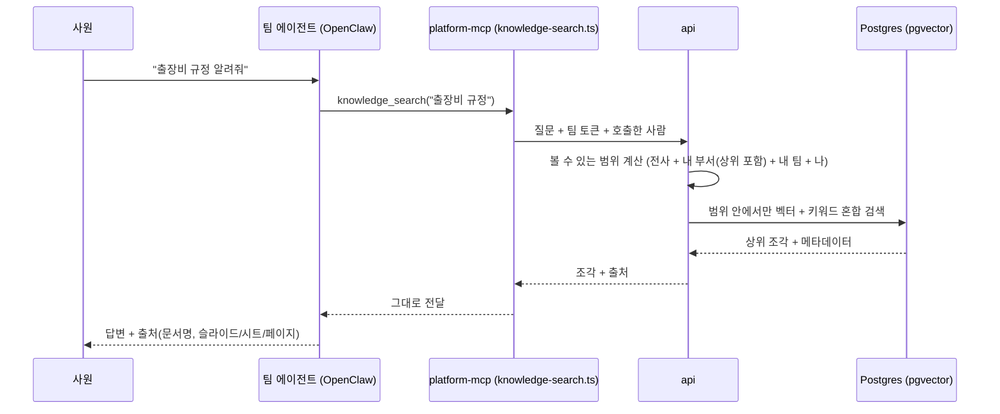

# 07. (v2) 지식 기능 — 설계 초안

> **v2 범위다. v1에서는 만들지 않는다.** v1 코드는 `04-api.md` §6 규칙만 지킨다.
> 이 문서는 방향을 잡아 두기 위한 초안이며, v2 시작 시 0단계와 같은 방식(화면·ERD·API)으로 다시 확정한다.

## 1. 목표

사내 문서(PPT, XLSX, DOCX, PDF)를 등록해 두면, 사원이 에이전트에게 질문할 때 **자기가 볼 수 있는 문서 안에서만** 근거를 찾아 출처와 함께 답한다.

```
문서 등록 → 변환·분할 → 메타데이터 → 임베딩 저장 → 에이전트가 knowledge_search로 권한 필터된 검색 → 답변 + 출처
```

## 2. 흐름



- `knowledge-search.ts`는 **전달만** 한다. 권한 판단·검색은 api 한 곳에서.
- 사람 단위 권한은 "호출한 사람 신원"(`06-auth.md` §8)에 달려 있다. 신원을 못 받으면 팀 단위 권한까지만 가능.

## 3. 등록과 메타데이터

- 등록 경로: 파일 업로드, 드라이브에서 "지식으로 등록"
- 메타데이터: 제목, 설명, 분류·태그, 담당 부서, 작성자·담당자, **공개 범위**, 유효 기간, 버전
- 제목·요약·태그는 LLM이 초안 → 등록자가 확인
- (선택) 담당자 승인 후 게시 — MCP 심사와 같은 패턴

### 공개 범위

| 범위 | 볼 수 있는 사람 |
|---|---|
| 전사 | 로그인한 모든 사원 |
| 부서 | 지정 부서 구성원(하위 부서 포함 여부 선택) |
| 팀 | 지정 에이전트 팀 멤버 |
| 개인 | 지정한 사람 |

여러 개를 조합할 수 있다(예: 인사팀 + 경영지원본부). 부서 권한은 v1에서 만든 `departments.path`로 계산한다.

## 4. 변환·분할 (형식별)

| 형식 | 처리 |
|---|---|
| PPT | 슬라이드 단위. 제목 + 본문 + 발표자 노트를 한 조각 |
| XLSX | 시트별 표 구조 유지. 머리행 + 행 묶음을 조각으로, 시트 요약도 별도 조각 |
| DOCX·PDF | 헤딩 기준 분할, 조각마다 상위 제목 경로를 붙임 |
| 스캔 PDF·이미지 | OCR 후 처리 (v2 후반) |

조각마다 **문서 제목 + 섹션 경로 + 위치(슬라이드·시트·페이지) + 메타데이터**를 붙인다.

## 5. 저장 (초안 테이블)

| 테이블 | 핵심 컬럼 |
|---|---|
| `kb_documents` | id, title, description, category, tags[], owner_department_id, owner_user_id, status(draft/in_review/published/archived), valid_until, current_version_id |
| `kb_document_versions` | id, document_id, version, file_path, file_type, uploaded_by, processed_status, created_at |
| `kb_chunks` | id, version_id, ordinal, text, location(jsonb: slide/sheet/page), heading_path, embedding `vector(n)`, embedding_model, tsv(`tsvector`, 키워드 검색) |
| `kb_acl` | document_id, scope_type(company/department/team/user), scope_id, include_descendants |
| `kb_search_logs` | user_id, team_id, query, result_count, top_document_ids, created_at |

- 파일은 `/data/knowledge/{documentId}/{version}/`
- 임베딩 모델은 **한국어 성능** 우선(외부 다국어 API 또는 사내 설치형 BGE-M3 등). 모델 이름을 조각마다 저장해 교체 시 재임베딩 대상 파악
- 인덱스: `embedding` HNSW, `tsv` GIN

## 6. 검색

- **벡터 + 키워드 혼합**(제품명·코드·약어 대응), 점수 합산 후 상위 N
- **권한 필터는 검색 쿼리 안에서** (`kb_acl` 조인). 결과를 받은 뒤 거르지 않는다
- 유효 기간이 지난 문서는 제외하거나 "오래된 문서"로 표시
- 결과에 항상 출처(문서 제목, 위치, 링크)

## 7. platform-mcp 도구

| 도구 | 입력 | 동작 |
|---|---|---|
| `knowledge_search` | `query`, `limit?`, `category?` | 권한 필터된 상위 조각 + 출처 |
| `knowledge_get` | `documentId`, `location?` | 특정 문서·위치의 조각 원문 |

에이전트 기본 지시문: 사내 규정·양식·과거 자료 질문은 먼저 `knowledge_search`를 쓰고, 답변에 출처를 붙인다. 근거가 없으면 없다고 말한다.

## 8. 예정 화면

| ID | 화면 | 누가 |
|---|---|---|
| K-01 | 지식 검색·목록 (분류·부서·태그 필터, 문서 카드) | 사원 |
| K-02 | 문서 등록 (업로드 → 메타데이터(LLM 초안) → 공개 범위 → 처리 진행) | 사원·담당자 |
| K-03 | 문서 상세 (미리보기, 메타데이터, 버전, 공개 범위, 처리 상태) | 사원 |
| A-14 | 지식 관리 (전체 문서, 승인 대기, 처리 실패, 검색 기록·못 찾은 질문) | 관리자 |

헤더 전사 범위에 "지식" 메뉴가 추가된다.

## 9. v2 범위 제안

- 1차: PPT·XLSX·DOCX·PDF(텍스트) + 전사/부서/팀 공개 범위 + 혼합 검색 + 출처 + K-01~K-03
- 2차: OCR, 승인 흐름, 개인 단위 공개, 검색 기록 분석(A-14), 문서 수정 시 부분 재처리

## 10. v1에서 지켜둘 것 (다시 정리)

- Postgres는 `pgvector/pgvector:pg16` 이미지로 시작
- platform-mcp는 도구 하나 = 파일 하나
- 권한 판단은 api 한 곳
- 부서 코드·사번은 사내 실제 값으로 넣기(v1 CSV 가져오기부터)
- 1단계 결론(spike 05): OpenClaw는 MCP 호출에 호출자 신원을 넘기지 않는다. v2에서 사람 단위 지식 권한이 필요하면 `mcp.servers.<name>.oauth.identity: "per-requester"` + KACP api를 OAuth 인가 서버로 만드는 안을 검토한다. 그 전까지는 팀 단위 권한만 가능하다.
