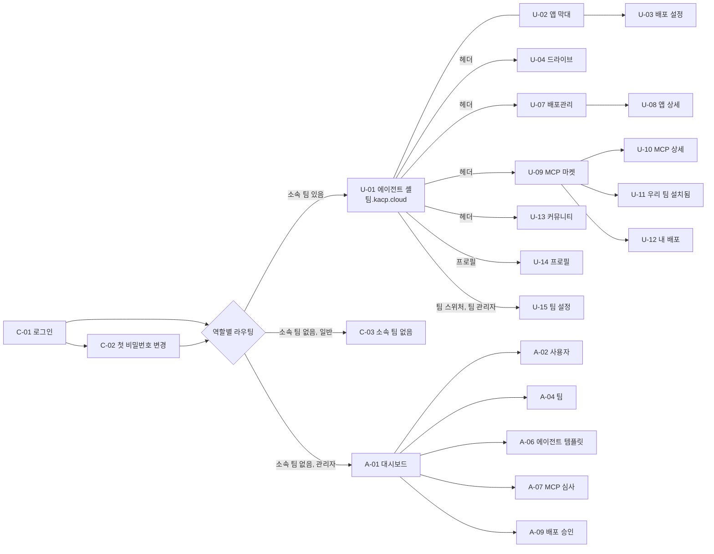

# 01. 화면 설계 — 목록과 설명

화면 시안은 Claude Design으로 만든다. 이 문서는 **무엇이 있어야 하고 무엇을 하는지**를 정한다.
Claude Design에 넘길 때는 화면 하나씩 이 문서의 해당 절 + `02-design-system.md`를 같이 준다.

- 화면 ID: `C-` 공통, `U-` 사원(팀원·팀 관리자), `A-` 플랫폼 관리자
- "데이터" 칸의 API는 `04-api.md` 기준(접두어 `/api/v1` 생략)
- 상태 문구와 배지 색은 `02-design-system.md`의 상태 표를 그대로 쓴다

## 1. 화면 지도

## 2. 호스트별 화면 배치

| 호스트 | 화면 |
|---|---|
| `app.kacp.cloud` | C-01~C-04, U-04~U-15, A-01~A-11 |
| `팀.kacp.cloud` | U-01 에이전트 셸(+U-02, U-03). `/claw/*`는 OpenClaw Control UI(iframe 안) |
| `앱--팀.kacp.cloud`, `앱.kacp.cloud` | 앱 자체. 앱이 없거나 멈췄으면 C-04 |

웹은 한 앱(`apps/web`)이 두 호스트를 모두 서빙하고, 호스트를 보고 라우터를 고른다.
헤더의 "에이전트"는 `https://{team}.kacp.cloud/`로, 나머지 메뉴는 `https://app.kacp.cloud/...`로 이동한다(쿠키가 `.kacp.cloud`라 로그인 유지).

---

## 3. 공통 (C)

### C-00 공통 레이아웃 · 헤더

모든 로그인 후 화면(에이전트 셸 포함)의 상단 헤더. 높이는 낮게(48px 내외) 유지한다 — 에이전트 셸에서 iframe 공간을 최대한 남기기 위해서다.

| 영역 | 요소 | 설명 |
|---|---|---|
| 왼쪽 | 로고 | 클릭 시 현재 팀 에이전트로 |
| 왼쪽 · 팀 범위 | **팀 스위처** | 현재 팀 이름 + 드롭다운. 소속 팀 목록, 각 팀의 컨테이너 상태 점(실행 중/정지). 팀 관리자면 "팀 설정" 항목 |
| 왼쪽 · 팀 범위 | 에이전트 · 드라이브 · 배포관리 | 현재 팀 기준 메뉴. 현재 위치 강조 |
| 오른쪽 · 전사 범위 | 커뮤니티 · MCP 마켓 | 팀과 무관한 전사 메뉴. 팀 범위와 시각적으로 구분(구분선) |
| 오른쪽 | 알림 종 | 안 읽은 개수 배지. 클릭 시 C-06 |
| 오른쪽 | 프로필 | 이름 이니셜 아바타. 메뉴: 내 정보(U-14), 관리자 화면(플랫폼 관리자만), 로그아웃 |

- 관리자 화면(`/admin`)에서는 헤더 왼쪽이 "관리자" 표시 + 관리자 메뉴 사이드바로 바뀐다. 프로필 메뉴에 "사원 화면으로" 항목.
- 현재 팀은 URL(`/t/{team}/...` 또는 팀 호스트)이 결정한다. 마지막으로 쓴 팀은 로컬 저장소에 기억해 로그인 직후 이동에 쓴다.
- 데이터: `GET /auth/me`, `GET /me/teams`, `GET /me/notifications/unread-count`

### C-01 로그인 — `app.kacp.cloud/login`

- 누가: 로그인 안 한 모든 사용자
- 구성: 로고와 서비스명, 이메일, 비밀번호, 로그인 버튼, 오류 문구 영역. 회원가입·비밀번호 찾기 링크는 **없다**(계정은 관리자가 만든다). "계정이 없거나 비밀번호를 잊었다면 관리자에게 문의하세요" 안내 문구.
- 동작: 성공 시 `next` 파라미터 주소로(허용 도메인 `*.kacp.cloud`만), 없으면 역할별 라우팅.
  - `must_change_password`면 C-02로
  - 소속 팀 있음 → 마지막 팀(없으면 첫 팀)의 에이전트 셸
  - 소속 팀 없음 + 플랫폼 관리자 → A-01
  - 소속 팀 없음 + 일반 → C-03
- 상태: 잘못된 계정/비밀번호(같은 문구로, 어느 쪽이 틀렸는지 알리지 않음), 비활성 계정, 시도 제한 잠김("15분 후 다시 시도하세요").
- 데이터: `POST /auth/login`

### C-02 첫 로그인 비밀번호 변경 — `/password/setup`

- 누가: `must_change_password = true`인 사용자. 이 화면을 끝내기 전에는 다른 화면으로 못 간다.
- 구성: 안내 문구, 새 비밀번호, 새 비밀번호 확인, 비밀번호 규칙 표시(충족 시 체크), 저장.
- 데이터: `POST /auth/password` (현재 비밀번호 대신 임시 비밀번호 세션으로 허용)

### C-03 소속 팀 없음 — `/no-team`

- 누가: 로그인했지만 어떤 팀에도 속하지 않은 일반 사용자
- 구성: 안내 일러스트 자리, "아직 소속된 팀이 없어요. 관리자에게 팀 배정을 요청하세요", 전사 메뉴(커뮤니티·MCP 마켓 둘러보기) 링크, 로그아웃.
- 헤더: 팀 범위 메뉴 숨김, 전사 메뉴만.

### C-04 오류·안내 페이지

같은 레이아웃에 문구만 다른 전체 화면 안내.

| 종류 | 언제 | 문구 방향 |
|---|---|---|
| 404 | 등록되지 않은 팀·앱 주소, 없는 페이지 | 주소를 확인하세요 + 홈으로 |
| 403 | 다른 팀 주소, 권한 없는 관리자 화면 | 이 팀 멤버만 볼 수 있어요 + 내 팀으로 |
| 앱 중지됨 | 등록된 앱이지만 멈춤 | 이 앱은 지금 멈춰 있어요. 팀원이면 배포관리에서 다시 시작 |
| 점검 중 | 플랫폼 오류 | 잠시 후 다시 시도 |

### C-05 공통 모달·토스트 규칙

- 삭제·중지·반려 등 되돌릴 수 없는 동작은 확인 모달(`ConfirmDialog`). 팀·사용자 삭제는 이름 직접 입력.
- 오래 걸리는 작업(컨테이너 기동, 빌드)은 모달을 닫아도 진행되고, 끝나면 알림 + 토스트.

### C-06 알림 패널 (헤더 드롭다운)

- 구성: 최근 알림 목록(아이콘, 한 줄 제목, 상대 시각, 안 읽음 점), "모두 읽음", 항목 클릭 시 관련 화면으로 이동.
- 알림 종류(v1): Public 승인/반려, MCP 빌드 성공/실패, MCP 심사 승인/반려, 팀 컨테이너 오류, 에이전트 할당 변경, (관리자) 새 승인·심사 요청.
- 데이터: `GET /me/notifications`, `POST /me/notifications/read`

---

## 4. 사원 화면 (U)

### U-01 에이전트 셸 — `https://{team}.kacp.cloud/`

- 누가: 그 팀 멤버
- 목적: OpenClaw Control UI를 플랫폼 안에서 쓰게 하는 얇은 껍데기. **셸은 헤더와 앱 막대만 그리고 나머지는 전부 iframe**(`/claw/`)이다. OpenClaw 화면을 흉내 내거나 덮지 않는다.
- 구성
  - 상단: C-00 헤더
  - 본문: Control UI iframe (전체 폭·남은 높이)
  - 앱 막대(U-02): 이 팀에 실행 중인 앱이 있을 때만 표시
- 상태 (가장 중요한 부분)

| 상태 | 화면 |
|---|---|
| 기동 중 (`starting`) | iframe 자리에 로딩 화면. "팀 에이전트를 준비하고 있어요" + 진행 표시 + 예상 시간(보통 수십 초). 2초 간격으로 상태 확인, `running`이 되면 iframe 로드 |
| 실행 중 (`running`) | iframe |
| 정지 (`stopped`) | 셸 진입 시 자동으로 기동 요청 → 기동 중 화면 |
| 오류 (`error`) | "에이전트를 시작하지 못했어요" + 다시 시도 버튼 + (팀 관리자) 오류 요약. 관리자에게 알림 |
| 할당된 에이전트 없음 | iframe은 뜨되 셸 상단에 얇은 안내 띠 "아직 이 팀에 할당된 에이전트가 없어요" |

- 동작
  - 진입 시 `POST /teams/{team}/session`으로 기동 보장 + 참조 카운트 시작
  - 열려 있는 동안 60초마다 `POST /teams/{team}/heartbeat`(탭이 숨겨져 있어도 보냄). 이 신호가 끊기면 유휴 정지 대상
  - 셸 헤더에서 다른 팀으로 바꾸면 그 팀 호스트로 이동
- 데이터: `POST /teams/{team}/session`, `GET /teams/{team}/status`, `POST /teams/{team}/heartbeat`, `GET /teams/{team}/apps?status=running`
- ⚠️ 1단계 확인: iframe 헤더 재작성, 페어링 화면 없이 접속(`deviceAutoApprove`), 팀원 간 세션 분리

### U-02 앱 막대 + 앱 미리보기 (셸 내부 컴포넌트)

- 위치: 에이전트 셸 헤더 바로 아래 얇은 띠(접기 가능). 실행 중인 앱이 없으면 숨김.
- 구성: 앱 칩 목록(앱 이름, 상태 점, 만든 사람, Private/Public 배지). 칩 클릭 시 메뉴:
  - **미리보기**: 오른쪽에서 열리는 패널(폭 조절 가능)에 앱을 iframe으로 표시 + 새 탭으로 열기 + 주소 복사
  - **배포 설정**: U-03 모달
  - **중지**(만든 사람·팀 관리자)
- 에이전트가 `run_app`으로 새 앱을 띄우면 막대에 새 칩이 생기고 토스트 "새 앱이 실행됐어요: lunch-vote". 반영은 상태 조회 주기(10초) 또는 알림 기반.
- 데이터: `GET /teams/{team}/apps?status=running`, `POST /apps/{appId}/stop`

### U-03 배포 설정 모달

- 진입: 앱 막대, 배포관리(U-08)
- 구성
  - 앱 이름(Public 전환 시 쓸 이름. 기본값 = 현재 앱 이름, 네임스페이스 중복 실시간 검사)
  - 공개 범위 선택: **Private**(팀만, `앱--팀.kacp.cloud`, 즉시) / **Public**(로그인한 전 사원, `앱.kacp.cloud`, 관리자 승인 필요)
  - Public 선택 시: 공개 이유(필수, 짧은 글), 원본 폴더 표시, "승인되면 요청 시점의 파일이 스냅샷으로 공개돼요" 안내
  - 요청 후에는 **진행 단계 표시**: 요청됨 → 검토 중 → 승인 → 공개됨 (반려 시 반려 사유 표시 + 다시 요청)
  - 요청 취소 버튼(대기 중일 때)
  - Public 앱이면: "Private으로 되돌리기"
- 규칙: 승인 전에는 Private 주소가 계속 동작한다.
- 데이터: `GET /apps/{appId}`, `GET /names/check`, `POST /apps/{appId}/public-request`, `DELETE /apps/{appId}/public-request`, `POST /apps/{appId}/unpublish`

### U-04 드라이브 — `app.kacp.cloud/t/{team}/drive/{space}/{path...}`

- 누가: 팀 멤버. `space` = `me`(내 드라이브) | `shared`(팀 공유)
- 레이아웃: 왼쪽 트리 / 가운데 파일 목록 / 오른쪽 상세 패널(U-05, 선택 시)
- 구성
  - 트리: "내 드라이브", "팀 공유" 두 루트 + 하위 폴더(펼칠 때 불러오기), 아래에 "휴지통"
  - 상단 막대: 경로 브레드크럼, 검색창(현재 공간 전체), 업로드(파일·폴더, 드래그 앤 드롭), 새 폴더, 보기 전환(목록/격자)
  - 파일 목록 열: 이름(아이콘), 만든 사람(사람 또는 **에이전트 배지**), 수정 시각, 크기
  - 여러 개 선택 → 다운로드(zip), 이동, 복사, 휴지통으로
  - 행 메뉴: 열기(미리보기 가능한 형식: 이미지, PDF, 텍스트·마크다운, 코드), 다운로드, 이름 변경, 이동, 복사, 휴지통으로
  - 폴더 행 메뉴에 "이 폴더로 앱 실행 요청은 에이전트에게" 같은 안내는 넣지 않는다(앱 실행은 에이전트만)
- 상태: 빈 폴더(업로드 유도), 업로드 진행(하단 진행 패널, 파일별 진행률·취소), 용량 초과, 권한 없음
- 권한: 내 드라이브는 본인만, 팀 공유는 팀원 전체 읽기·쓰기. 다른 사람의 내 드라이브는 **팀 관리자도 볼 수 없다**.
- 데이터: `GET /teams/{team}/drive/list`, `GET .../drive/search`, `POST .../drive/upload`, `GET .../drive/download`, `POST .../drive/folder`, `POST .../drive/move`, `POST .../drive/copy`, `POST .../drive/rename`, `POST .../drive/trash`

### U-05 파일 상세 패널

- 구성: 미리보기 썸네일, 이름, 종류, 크기, 위치(경로 복사), 만든 사람/에이전트 배지, 만든 시각·수정 시각, 권한("나만" / "팀 전체"), **변경 기록**(누가·무엇을·언제: 업로드, 에이전트 저장, 이름 변경, 이동 등)
- 에이전트 배지: platform-mcp 드라이브 도구로 저장된 파일, 또는 에이전트 샌드박스가 만든 파일. "에이전트 · 홍길동 요청" 형태로 요청자를 함께 표시.
- 기록이 없는 파일(플랫폼 밖에서 생긴 파일)은 "기록 없음".
- 데이터: `GET /teams/{team}/drive/meta`

### U-06 휴지통 — `/t/{team}/drive/trash`

- 구성: 지운 항목 목록(이름, 원래 위치, 지운 사람, 지운 시각, 자동 삭제까지 남은 일수), 복원, 영구 삭제, 휴지통 비우기(내 항목만).
- 규칙: 30일 뒤 자동 영구 삭제(제안). 내 드라이브 항목은 본인만, 팀 공유 항목은 팀원 모두 복원 가능, 영구 삭제는 지운 사람·팀 관리자.
- 데이터: `GET .../drive/trash`, `POST .../drive/trash/{id}/restore`, `DELETE .../drive/trash/{id}`

### U-07 배포관리 목록 — `/t/{team}/apps`

- 누가: 팀 멤버
- 구성: 필터(상태: 전체/실행 중/정지/오류, 범위: Private/Public/승인 대기, 만든 사람: 나/전체), 검색, 앱 카드 또는 표
  - 열: 앱 이름, 상태 배지, 공개 범위 배지(+승인 대기), 주소(복사), 만든 사람, 마지막 실행, CPU·메모리 사용량(작은 막대)
- 빈 상태: "아직 실행한 앱이 없어요. 에이전트에게 '이 폴더를 웹 앱으로 띄워줘'라고 말해 보세요"
- 데이터: `GET /teams/{team}/apps`

### U-08 앱 상세 — `/t/{team}/apps/{appId}`

- 구성
  - 머리: 앱 이름, 상태, 공개 범위, 주소(열기·복사), 주요 버튼(시작/중지/재시작, 배포 설정 U-03)
  - 개요 탭: 만든 사람, 원본 폴더(드라이브로 이동 링크), 실행 명령·포트, 만든 시각, Public이면 승인자·승인 시각·스냅샷 시각
  - 리소스 탭: CPU·메모리 현재값과 한도, 최근 1시간 추이(간단 선 그래프)
  - 로그 탭: 최근 로그(최신 순 tail, 자동 새로고침 토글, 다운로드)
  - 공개 이력 탭: 요청·승인·반려 기록
  - 위험 영역: 앱 삭제(컨테이너와 라우트 제거, 원본 폴더는 남음)
- 권한: 보기 = 팀원, 시작·중지·삭제 = 만든 사람·팀 관리자
- 데이터: `GET /apps/{appId}`, `GET /apps/{appId}/stats`, `GET /apps/{appId}/logs`, `POST /apps/{appId}/start|stop|restart`, `DELETE /apps/{appId}`

### U-09 MCP 마켓 목록 — `app.kacp.cloud/market`

- 누가: 로그인한 모든 사용자(전사 범위). 설치는 팀 관리자만(현재 팀 기준).
- 탭: **마켓**(이 화면) / **우리 팀 설치됨**(U-11) / **내 배포**(U-12)
- 구성: 검색, 분류 필터, 정렬(인기순=설치 팀 수, 최신순), 카드(아이콘, 이름, 한 줄 설명, 만든 사람, 설치 팀 수, "기본 제공" 배지, 현재 팀에 설치됨 배지)
- 데이터: `GET /mcp/packages`

### U-10 MCP 상세 + 설치 — `/market/{package}`

- 구성
  - 머리: 아이콘, 이름, 만든 사람, 최신 버전, 설치 팀 수, 설치 버튼(팀 관리자) / "팀 관리자에게 설치를 요청하세요"(팀원)
  - README(매니페스트의 README가 그대로 렌더링됨)
  - **도구 목록**: 빌드 테스트에서 추출한 `tools/list` 결과(도구 이름, 설명, 입력 인자)
  - **권한**: 필요한 비밀값(이름·범위 팀/개인·설명), 접근하는 네트워크 대상(도메인 목록), 리소스 요구량
  - **예시 문장**: "이번 주 회의록을 요약해서 드라이브에 저장해줘" 같은 사용 예
  - 버전 이력
- 설치 모달(팀 관리자)
  1. 대상 팀 확인(팀 관리자인 팀만 선택 가능)
  2. 권한 확인(네트워크 대상·비밀값 목록 체크박스로 동의)
  3. 비밀값 입력(팀 범위 비밀값만. 개인 범위는 각 팀원이 나중에 입력한다는 안내) — 입력값은 가려서 표시, 저장 후 다시 보여주지 않음
  4. 설치 진행(MCP 컨테이너 기동 → 팀 Gateway 반영) → 완료
- 데이터: `GET /mcp/packages/{pkg}`, `POST /teams/{team}/mcp/installs`

### U-11 우리 팀 설치됨 — `/market/installed?team={team}`

- 구성: 현재 팀에 설치된 MCP 표
  - 열: 이름, 출처 배지(**마켓** / **직접 추가 · 검토되지 않음** / **기본 제공**), 버전, 상태(설치됨/오류/설치 중), 설치한 사람, **마지막 확인 시각**
  - 팀 관리자 행 메뉴: 비밀값 다시 입력, 제거, (직접 추가) "마켓에 정식 등록하기" 안내 링크
- 팀 컨테이너가 꺼져 있으면 상단에 "팀 에이전트가 꺼져 있어 마지막으로 확인한 목록을 보여줘요" 안내. 목록 조회만을 위해 컨테이너를 깨우지 않는다.
- 데이터: `GET /teams/{team}/mcp/installs`

### U-12 내 배포 (MCP 업로드) — `/market/mine`

- 누가: 모든 사용자(개발자)
- 구성
  - 내 패키지 목록(이름, 최신 버전, 게시 상태, 설치 팀 수)
  - **새 버전 올리기**: zip 드래그 앤 드롭(`create-platform-mcp pack` 결과물), 스캐폴딩 사용법 링크
  - 버전 상세(행 펼침 또는 별도 화면): 진행 단계 스테퍼 **업로드 → 검증 → 빌드 → 보안 스캔 → 테스트 → 심사 대기 → 게시됨**, 단계별 로그(접기), 실패 시 실패 단계와 원인, 반려 시 사유
  - 스캔 결과 요약(심각도별 개수), 테스트에서 추출한 도구 목록
- 데이터: `GET /me/mcp/packages`, `POST /mcp/uploads`, `GET /mcp/packages/{pkg}/versions/{ver}`, `GET .../versions/{ver}/logs`

### U-13 커뮤니티 — `app.kacp.cloud/community`

- 목록: 분류 탭(전체/공지/질문/팁/MCP 공유/앱 자랑), 검색, 글 목록(제목, 분류, 작성자, 시각, 첨부된 MCP·앱 배지)
- 글 보기: 본문(마크다운), 첨부 MCP 카드(**여기서 바로 설치** — 팀 관리자면 U-10 설치 모달), 첨부 Public 앱 카드(열기), 수정·삭제(작성자·플랫폼 관리자)
- 글쓰기: 분류, 제목, 본문(마크다운 에디터 + 미리보기), MCP 첨부(내가 볼 수 있는 게시된 MCP 검색), Public 앱 첨부. 공지 분류는 플랫폼 관리자만.
- v1 범위 밖: 댓글, 좋아요(필요하면 v1.1)
- 데이터: `GET /posts`, `GET /posts/{id}`, `POST /posts`, `PATCH /posts/{id}`, `DELETE /posts/{id}`

### U-14 프로필 — `/me`

- 구성
  - 내 정보: 이름, 이메일, 플랫폼 역할, 소속 팀과 팀 역할 목록(읽기 전용)
  - 비밀번호 변경: 현재 비밀번호, 새 비밀번호, 확인
  - **내 계정 연결 상태**(팀별): OpenClaw Connected Accounts(모델 계정·외부 서비스)의 연결 여부 표시. 연결·해제 작업은 에이전트 화면(Control UI)에서 하도록 "에이전트 화면에서 연결하기" 링크.
  - 로그인 중인 세션 목록 + "다른 곳에서 모두 로그아웃"
- ⚠️ 1단계 확인: Connected Accounts 상태를 admin-http-rpc로 조회 가능한지. 안 되면 v1은 이 영역을 "에이전트 화면에서 확인" 링크로만 둔다.
- 데이터: `GET /auth/me`, `POST /auth/password`, `GET /teams/{team}/me/connections`, `GET /me/sessions`, `DELETE /me/sessions`

### U-15 팀 설정 — `/t/{team}/settings` (팀 관리자)

- 누가: 해당 팀의 팀 관리자(플랫폼 관리자도 접근 가능)
- 탭
  - 멤버: 멤버 목록(이름, 이메일, 팀 역할, 추가된 날), 멤버 추가(이미 있는 사용자 이메일 검색 — 계정 생성은 플랫폼 관리자만), 제거, 팀 관리자 지정·해제
  - MCP: U-11과 같은 목록 + **직접 추가**(이름, 연결 방식 URL, 필요한 헤더/비밀값) — 추가 시 "검토되지 않음" 경고 확인
  - 정보(읽기 전용): 팀 이름·주소, 할당된 에이전트 목록, 리소스 한도, 컨테이너 상태
- 데이터: `GET /teams/{team}/members`, `POST /teams/{team}/members`, `PATCH|DELETE /teams/{team}/members/{userId}`, `POST /teams/{team}/mcp/manual`, `GET /teams/{team}`

---

## 5. 관리자 화면 (A) — `app.kacp.cloud/admin/...`

공통: 왼쪽 사이드바(대시보드, 사용자, 팀, 에이전트 템플릿, MCP 심사, MCP 관리, 배포 승인, 플랫폼 설정, 활동 기록). 처리 대기 건수는 사이드바 배지로.
모든 목록 화면은 검색·필터·페이지 나누기와 CSV 내보내기는 v1 범위 밖.

### A-01 대시보드 — `/admin`

- 카드 줄: 활성 팀 수 / 전체 팀, 접속 중 사용자, 실행 중 앱, 처리 대기(Public 승인 n건, MCP 심사 n건 — 클릭 시 해당 화면)
- VM 리소스: CPU·메모리·디스크(`/data`) 현재 사용률 게이지 + 최근 24시간 추이. 경고 기준 넘으면 노란색/빨간색, 상단 **용량 경고** 띠("메모리 85% — 새 팀 기동이 실패할 수 있어요")
- 팀 컨테이너 표: 팀, 상태, 접속자 수, CPU·메모리(한도 대비), 마지막 활동, 바로가기(A-05)
- 안내: "자동 확장은 GKE 전환 단계 로드맵" 문구를 리소스 영역에 작게 표시
- 데이터: `GET /admin/dashboard`, `GET /admin/metrics?range=24h`

### A-02 사용자 목록 — `/admin/users`

- 열: 이름, 이메일, 플랫폼 역할, 소속 팀(태그), 상태(활성/비활성/비밀번호 변경 대기), 마지막 로그인
- 필터: 역할, 상태, 팀 / 검색: 이름·이메일
- 버튼: **사용자 추가**
- 데이터: `GET /admin/users`

### A-03 사용자 추가·상세 — `/admin/users/new`, `/admin/users/{id}`

- 추가(모달 또는 화면): 이메일(회사 이메일, 사용자 식별자), 이름, 플랫폼 역할(일반/관리자), 초기 비밀번호(자동 생성 버튼 + 직접 입력), 소속 팀과 팀 역할(선택, 여러 개). 저장 후 초기 비밀번호를 **한 번만** 보여주는 결과 화면(복사 버튼).
- 상세: 정보 수정(이름, 역할), 소속 팀 관리, **비밀번호 초기화**(새 임시 비밀번호 한 번 표시, 첫 로그인 변경 강제), **비활성화/재활성화**(비활성화 시 모든 세션 종료), 최근 로그인 기록, 이 사용자의 활동 기록
- 이메일은 생성 후 수정 불가(v1). 사용자 삭제는 없고 비활성화만.
- 데이터: `POST /admin/users`, `GET|PATCH /admin/users/{id}`, `POST /admin/users/{id}/reset-password`, `POST /admin/users/{id}/disable|enable`

### A-04 팀 목록 — `/admin/teams`

- 열: 팀 이름(= 서브도메인), 표시 이름, 멤버 수, 팀 관리자, 할당된 에이전트 수, 컨테이너 상태, 리소스 한도
- 버튼: **팀 만들기**(모달: 팀 이름 — 네임스페이스 실시간 검사, 표시 이름, 팀 관리자(사용자 검색), 리소스 한도 기본값 표시 → 생성 시 프로비저닝 진행 표시)
- 데이터: `GET /admin/teams`, `POST /admin/teams`, `GET /names/check`

### A-05 팀 상세 — `/admin/teams/{team}`

- 머리: 팀 이름, 주소(`팀.kacp.cloud` 열기), 컨테이너 상태, **시작 / 정지 / 재시작** 버튼
- 탭
  - 멤버: 추가(사용자 검색)·제거·팀 관리자 지정
  - **에이전트 할당**: 할당된 템플릿 목록(이름, 템플릿 버전, 적용 상태 **반영 완료/대기/실패**), "에이전트 할당"(템플릿 다중 선택), 해제. 팀이 실행 중이면 "적용하면 팀 에이전트가 잠깐 재시작돼요" 확인
  - 리소스: CPU·메모리·디스크 한도 입력(기본값 대비), 현재 사용량, 저장 시 실행 중이면 즉시 적용
  - MCP: 이 팀에 설치된 MCP(출처 포함, 읽기 전용 + 강제 제거)
  - 앱: 이 팀 앱 목록(U-07과 같은 열, 강제 중지)
  - 위험 영역: 팀 삭제(이름 입력 확인. 컨테이너·라우트·앱 제거, 데이터는 백업 폴더로 이동 후 30일 보관)
- 데이터: `GET /admin/teams/{team}`, `POST /admin/teams/{team}/container/{start|stop|restart}`, `PUT /admin/teams/{team}/resources`, `GET|POST|DELETE /admin/teams/{team}/agents`, `DELETE /admin/teams/{team}`

### A-06 에이전트 템플릿 — `/admin/agents`, `/admin/agents/{id}`

- 목록: 아이콘, 이름, 설명, 기본 모델, 할당된 팀 수, 수정 시각. **새 템플릿**, 복제
- 편집 화면(폼, 저장 시 버전 +1)
  - 기본: 이름, 아이콘(이모지 선택), 설명
  - 모델: 기본 모델(플랫폼 설정의 허용 모델 중), 추론 수준
  - 지시문: 여러 줄 편집기(마크다운). 플랫폼 기본 지시문은 자동으로 앞에 붙는다는 안내
  - 스킬: 포함할 스킬 선택/업로드(형식은 1단계에서 OpenClaw 문서 기준 확정)
  - 기본 MCP: 게시된 MCP 중 선택(할당 시 팀에 함께 설치)
  - 도구 권한: 허용/차단할 도구 목록(체크박스)
  - 오른쪽: "이 템플릿을 쓰는 팀" 목록, 저장 시 "n개 팀에 반영 대기" 안내
- v2로 미룸: 채널, 예약 작업, 메모리 설정
- 데이터: `GET|POST /admin/agent-templates`, `GET|PUT|DELETE /admin/agent-templates/{id}`

### A-07 MCP 심사 — `/admin/mcp/reviews`, `/admin/mcp/reviews/{versionId}`

- 목록: 심사 대기 버전(패키지, 버전, 올린 사람, 올린 시각, 스캔 심각도 요약)
- 상세
  - 매니페스트 요약: 이름, 버전, 설명, **선언 권한**(비밀값 목록·범위), **네트워크 대상**(도메인 — 사내·외부 구분 표시), 리소스
  - 스캔 결과: 심각도별 목록(Critical/High는 강조)
  - 테스트 결과: 추출한 도구 목록, 테스트 로그
  - 이전 버전과의 차이(권한·네트워크 대상 변경 강조)
  - 소스 zip 다운로드
  - **승인** / **반려**(사유 필수)
- 데이터: `GET /admin/mcp/reviews`, `GET /admin/mcp/versions/{id}`, `POST /admin/mcp/versions/{id}/approve|reject`

### A-08 MCP 관리 — `/admin/mcp`

- 탭
  - 패키지: 게시된 패키지 목록(상태 게시 중/게시 중단, 설치 팀 수), **게시 중단**(새 설치 차단, 기존 설치 유지 여부 선택), **전사 기본 MCP 지정**(새 팀 생성 시 자동 설치)
  - 팀별 설치 현황: 팀 × MCP 표 또는 목록(버전, 상태, 마지막 확인)
  - 직접 추가된 MCP: 팀, 이름, URL, 추가한 사람, 추가 시각 — 검토 대상 확인용
- 데이터: `GET /admin/mcp/packages`, `POST /admin/mcp/packages/{pkg}/suspend|resume`, `PUT /admin/mcp/packages/{pkg}/default`, `GET /admin/mcp/installs`

### A-09 배포 승인 — `/admin/deploy`

- 탭
  - Public 요청: 대기 목록(앱 이름, 팀, 요청자, 공개 이유, 요청 시각). 상세: 요청 이름, 원본 폴더 파일 목록, 현재 Private 주소(열어서 확인), **승인** / **반려(사유 필수)**
  - 공개 중인 앱: Public 앱 목록(이름, 팀, 승인자, 공개 시각, 상태), **강제 중지**(사유 필수, 팀에 알림)
  - 처리 이력
- 데이터: `GET /admin/deploy-requests`, `POST /admin/deploy-requests/{id}/approve|reject`, `GET /admin/apps?visibility=public`, `POST /admin/apps/{id}/force-stop`

### A-10 플랫폼 설정 — `/admin/settings`

- 모델: 허용 모델 목록(추가·순서·기본값), **공용 API 키**(제공자별, 입력 후 가려짐, "변경"만 가능)
- 기본 리소스 한도: 팀 CPU·메모리·디스크, 앱 CPU·메모리, MCP 컨테이너 CPU·메모리
- 운영: 유휴 정지 시간(분), 용량 경고 기준(CPU·메모리·디스크 %), 휴지통 보관 일수
- 예약어 목록(읽기 전용 기본 + 추가)
- 데이터: `GET /admin/settings`, `PUT /admin/settings`, `PUT /admin/settings/api-keys/{provider}`

### A-11 활동 기록 — `/admin/audit`

- 열: 시각, 행위자, 행위(생성/삭제/승인/반려/설치/제거/할당/해제/비활성화/비밀번호 초기화/컨테이너 제어), 대상(종류·이름), 팀, 상세(펼침 — 변경 전후 요약)
- 필터: 기간, 행위자, 행위 종류, 대상 종류, 팀
- 데이터: `GET /admin/audit-events`

---

## 6. 화면별 권한 요약

| 화면 | 팀원 | 팀 관리자 | 플랫폼 관리자 |
|---|---|---|---|
| U-01~U-08 (자기 팀) | ○ | ○ | 팀 멤버일 때만 (아니면 A-05로) |
| U-02·U-08 앱 중지·삭제 | 자기 앱 | ○ | ○ |
| U-09·U-10 보기 | ○ | ○ | ○ |
| U-10 설치 | ✕ | ○ | ○ |
| U-12 내 배포 | ○ | ○ | ○ |
| U-15 팀 설정 | ✕ | ○ | ○ |
| A-* | ✕ | ✕ | ○ |

플랫폼 관리자라도 다른 사람의 "내 드라이브"는 화면에서 볼 수 없다(운영 목적 접근은 VM에서 직접, 활동 기록 남김).

## 7. Claude Design에 넘길 때 체크

- 헤더(C-00)를 먼저 만들고 모든 화면이 같은 헤더를 쓰게 한다
- 에이전트 셸(U-01)은 iframe 자리를 회색 플레이스홀더로 두고 **기동 중/오류 상태 시안을 따로** 만든다
- 목록 화면마다 빈 상태·로딩·오류 시안을 한 장씩
- 진행 단계 스테퍼는 U-03(Public 요청)과 U-12(MCP 버전)에서 같은 컴포넌트를 쓴다
- 상태 배지 문구·색은 `02-design-system.md` 표를 그대로 넣는다
